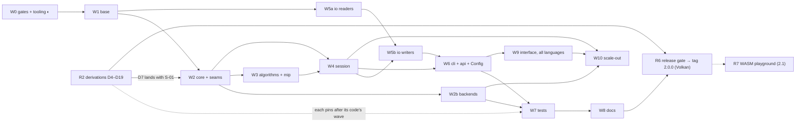

# DTWC++ 2.0 — PLAN

Branch `design-2.0`. Written 2026-09-21 against `MAP.md` (as-is) and `design.md` (target).
Row IDs (`C-`, `O-`, `A-`, `B-`, `T-`, `G-`) are rows of `specs/2026-09-07-diff-ledger.md`; `F-` and `D-`
numbers are the public finding / derivation numbers of the archived plan; `S-`, `X-`, `H-` are new here (§5).

## 0. How to use this plan

**Reading order for any session:** `CLAUDE.md` → `CHARTER.md` → `MAP.md` → `design.md` → *your wave's
card below* → the ledger rows it names → the deep-dive section a row cites. Nothing else. A wave card
lists its **context pack**: the only source files an implementer should open before starting.

**Who does what:** the orchestrating session plans, dispatches and reviews; implementers (Opus, ≤ 4 at a
time, never on the same files) take one card slice each: *failing or pinning test first → change → gate →
one commit*; a separate adversarial reviewer checks every wave's diff for design fit, new branches /
allocations / locks in hot paths, and a grep proof for every deletion. Decisions in §7 are Volkan's.

**Status legend:** ☐ todo · ◐ in progress · ☑ done · ✗ falsified (with evidence) · ⏸ blocked on a decision.
Row-level status lives in the ledger (add a `status` column when a wave opens); this file tracks waves.

## 1. Where we are (2026-09-21)

- Released: **v1.0.0**. `VERSION` = `2.0.0rc1`, untagged, 781 commits later. Users are on the 1.x shape.
- Spec and 129-row ledger **approved 2026-09-07**; every III.10 decision adopted (`DECISIONS.md` §3).
- **W0 ◐**: tasks 0, 1a, 1b, 1c done (`d21ffee`, `22c4c5f`): every test registers through
  `dtwc_add_test`, floors in `tests/floors.cmake`. Tasks 2–13 open.
- **Two regressions from that work, found and verified today** (`baselines/2026-09-21-macos-first-baseline.md`):
  floors were measured on Windows only → **5 of 131 tests fail on macOS on floors alone**; and the CI docs gate
  fails (`D2/D3 CTest drift`) because it still pins the old registration blocks. Neither was noticed because
  **pushes to `design-2.0` trigger no workflow**.
- New development machine is a Mac (Apple clang 21, libomp, Metal): the tree builds in 2.5 min and the serial
  suite runs in 129 s. Metal is now local; **CUDA is `[BLOCKED-ENV]` here**.
- `design.md` proposes eighteen amendments to the spec (§11 there); they need approval (§7, D-1). A1–A10 came
  from the mapping; **A11–A18 from a four-lens review on 2026-09-22** (Python API, C++ language, C++ software
  design, time-series science), each claim re-opened at its line before it entered the plan.

## 2. Dependencies

### 2.1 What a machine needs

| Need | macOS (this machine) | Linux | Windows | Required? |
| --- | --- | --- | --- | --- |
| C++20 compiler | Apple clang 21 (Command Line Tools) | GCC 11/12, Clang 14–17 | MSVC 19.3x, clang-cl | yes |
| CMake ≥ 3.26, Ninja | `brew install cmake ninja` | apt / pip | installer | yes |
| OpenMP | `brew install libomp`, configure with `-DOpenMP_ROOT=/opt/homebrew/opt/libomp` | bundled | `/openmp:experimental` | yes, unless `-DDTWC_ALLOW_SEQUENTIAL=ON` |
| Python via **`uv`** | present | — | — | tests (Python ≥ 3.9), scripts, wheels |
| Doxygen + Graphviz | `brew install doxygen graphviz` | apt | — | docs, `repo_map.py symbols` |
| Hugo extended 0.147.8, Pagefind 1.3.0 | not installed | CI | — | docs site only |
| CUDA toolkit | unavailable | CI smoke / RTX box / ARC | RTX box | optional — **W2b CUDA rows cannot be verified here** |
| MATLAB R2024b+, MPI, Gurobi, Arrow | not installed | CI | CI | optional |

Fetched at configure time (network needed until B-17 vendors CPM): Eigen 5.0.1, CLI11 2.6.2, fkYAML 0.4.4,
HiGHS 1.15.1, llfio + quickcpplib (commit pins), Catch2 3.13.0; on demand Arrow 19.0.1, Google Benchmark 1.9.5,
nanobind ≥ 2.0. Vendored: nanoarrow 0.8.0. Full table with gates: `MAP.md` §6.

```sh
cmake --preset clang-macos -DOpenMP_ROOT=/opt/homebrew/opt/libomp && cmake --build --preset clang-macos
ctest --test-dir build -C Release -j1 --output-on-failure      # serial is the evidence run
uv run --no-project python scripts/repo_map.py layers           # layer ratchet: 18 upward edges today
python3 scripts/check_record_hygiene.py && python3 scripts/check_repo_hygiene.py && python3 scripts/check_docs_contract.py
```

### 2.2 What blocks what



**Critical path:** W0 → W1 → W2 → W3 → W4 → W5b → W6 → W7 → W8 → R6. **Parallel lanes:** W5a beside
W2–W4 (io needs only base + core — a gain from the corrected layer order; its entry gate is W1's exit); W2b
beside W3; R2 derivations beside everything **except D7, which W2 needs**. W9's additive parts and all of W10
may land after the tag (§6 marks what must be `pre-tag`).

Where a ledger row names two waves, the card of the first wave lists it and the second half rides with the
file's own wave (A-01, A-10, O-10, O-11, O-19, B-20); G-09 follows the spec's IV.2 placement (W2b), not the
ledger's W7; the interface-campaign halves of A-04 and A-05 (exposing LR / CLARANS knobs; keep-or-delete) are W9.

### 2.3 Row-level ordering that bites

| First | Then | Why |
| --- | --- | --- |
| W0-R1, W0-R2 (repairs) | anything | a red baseline proves nothing |
| W0 Task 2 (T-15 read-only, hash-pinned conformance) | every "digit-identical" claim (W1 onward) | until then conformance is not a gate |
| R5 five canonical baselines + W0 Task 11 benchmarks | W2, W4 | the no-regression proof and the O-01 / C-06 / C-07 evidence must predate the change |
| W0 Task 9 manifest **with `design.md` §4 ranks** | W1 | the spec's order (io above session) can never go strict |
| W1 `parallel::for_each_pair` | C-07 | the brute-force fill adopts it |
| T-11a: move `dtwFull` / `dtwMissing` / `dtwAROW` full-matrix oracles into `tests/support` | C-09 deletions | the oracles must outlive their library copies |
| C-05 (`Auto` = BruteForce) | C-04 (one pruned fill) → C-25 dies | decides what the pruned fill is for |
| C-02 (`visit_variant`) | C-14, C-23, C-21b, T-10 equivalence test | one table, then everything that leans on it |
| C-01 (`DistanceConfig` by value), W2 | O-02, C-22, O-24, G-07 | the closure must stop capturing `*this` first |
| `DistanceOracle` + `Problem::oracle()` | A-02 (values out) → A-03 (one algorithm per task) → A-19, A-12 (D14) | O-03 step 1 before step 2 |
| A-02 | O-03 step 2, O-16 (Benders `friend`), Tier-1 `Result` | Tier-1 silently depends on the write-back today |
| O-08 (correct DCL, bind at the gateway) | A-23 | three hand-rolled "prime serially" sites collapse into it |
| W4 X-01 / X-02 (execution target, resolver) | W6 `Config`, W10 | `device` must exist on `Problem` before a run description can name it |
| O-09 decision (D-2) | W5b | one writer module, with or without a legacy writer |
| T-01 (cross-file call-count assertion) | every other W7 edit | each edit trips it |
| D17 (error model) | W7 tolerance forms, any SIMD prototype | derive the band, do not guess |
| D7 (Soft-DTW negativity) | S-01, W2 exit | same subject: the derivation decides what the diagonal is; fix and derivation land together |

## 3. Waves

Every wave: entry gate = previous exit gate; exit = its gate green on **macOS + the CI matrix**, conformance
digit-identical for every "no-op" claim, upward-edge count not higher, CHANGELOG line per user-visible change,
run-log in `baselines/`, handoff in `summaries/`.

### W0 — gates and tooling ◐
**Goal:** the gates exist, and are true, before anything they protect changes.
**Repair first (new, verified 2026-09-21):**
- ☐ **W0-R1** floors portable: re-run `scripts/measure_test_floors.py` with `ctest -V` logs from Windows
  clang, MSVC Debug, macOS Apple clang and Linux GCC; it already takes the minimum. Case floors stay exact.
- ☐ **W0-R2** docs gate: `check_docs_contract.py:1195-1203` (D2) and its D3 twin near `:1843` pin the
  `if(TARGET test_lb_…_derivation) … endif()` blocks that `d21ffee` replaced; pin the `dtwc_add_test` registration.
- ☐ **W0-R3** floor holes: an explicit `ASSERT_FLOOR` silently beats the measured table
  (`cmake/DtwcTest.cmake:121-130`); `MAY_SKIP` carries no floor (`:157`); seven device tests sit at `1;1`;
  `unit_test_mpi` passes on its own skip line. Read each site first — some explicit floors are said to be
  deliberately low on a build-flavour branch.
- ☐ **W0-R4** CHANGELOG: `22c4c5f` has no entry and the `d21ffee` bullet claims "every CTest entry is now gated".
- ☐ **W0-R5** CI: add `design-2.0` to the push filters of the unit workflows (or keep a draft PR to `main` open).

**Then** tasks 2–13 of `plans/2026-09-07-w0-baseline-tooling.md`, with these amendments: *Task 2* — the file is
`tests/conformance/cpp_conformance.cpp`; the reference **is** tracked, so the holes are exactly two: regen rewrites
tracked data and compares with what it wrote, and an absent reference passes vacuously. *Task 9* — port the manifest
from `scripts/repo_map.py` (`design.md` §4 ranks), not the spec's. *Task 12* — extend the disassembly script into
the **codegen report** (X-04): probe TU, vectorisation remarks, expectation table seeded from today's probe.
*Task 13* — floors live in `tests/floors.cmake` and the run-log (`AGENTS.md` is gone); the exit matrix gains macOS.
Add the **five canonical baselines** of R5 to the exit gate (dense N = 1000 × 512; banded 10 %; PAM N = 2000;
OneBatchPAM 50k; barycenter k-means k = 3), counters beside every time.
**Rows:** T-15, T-16, B-12, B-13, B-14, B-15, B-17, C-08, C-24, A-06 (evidence), S-03, S-09, **X-15**
(`DTWC_FP_MODEL=strict|fast`: FP flags `PRIVATE` to `dtwc++`, the conformance reference pinned under
`strict`, one CI leg per model — lands with S-03 because it is the same CMake lines).
**Context pack:** the one task section being executed · `cmake/DtwcTest.cmake` · `tests/CMakeLists.txt` ·
`tests/floors.cmake` · `baselines/2026-09-07-design-2.0-W0.md` · `baselines/2026-09-21-macos-first-baseline.md`.
**Gate:** all matrices + MSVC Debug + macOS green with every test floored; three gate scripts green; layer
report = 18; benchmarks and baselines recorded.

### W1 — base
**Goal:** a foundation layer that includes only the standard library, and the two parallel helpers.
**Rows:** C-11 (move `error`, `settings`, `missing_utils`, … into `dtwc/base/` by script, **forwarding headers at
the old paths for one release**), C-12, A-10, B-11 (saturating arithmetic), C-21a (`settings.hpp` stops pulling
`<iostream>`; `<random>` goes only when the process-global `randGenerator` it defines at `:55` moves to its own
header — **X-12**, done here, the engine itself stays for A-21), `parallel::for_each_pair` + `reduce`, X-05
(declare `available_ram_bytes()` in a base header — removes the only upward edge that is not `→ Problem.hpp`),
one `narrow<int>` / `checked_cast` in base used at gateways (`dist_by_ind(int,int)`, `ClusteringResult::
n_clusters()`; `fast_pam.cpp:60` already does it right), **X-16** the typed-throw ratchet script (256 untyped
`throw std::…` vs 227 typed today; the count may only fall), and the `settings::paths::{data,results}`
mutable globals become `Config` values (with X-12).
**Context pack:** MAP §2 *base*, §5 · `dtwc/{error,settings,missing_utils,parallelisation,timing}.hpp` ·
`dtwc/types/` · `dtwc/system_memory.cpp` · `dtwc/CMakeLists.txt`.
**Gate:** floors unchanged; layer check strict for `base`; upward edges 18 → 17; bindings still compile.

### W2 — core and the seams
**Goal:** `core/` names neither `Problem` nor a loader; one dispatch table; one pruned fill; one unit of work.
**Rows:** C-01, C-02, C-03, C-04, C-05, C-06 (hoist the visit only), C-07, C-09 (under D-3), C-10, C-14, C-15,
C-19, C-20, C-21b, C-23, C-25; F47 (with C-09 and `check_docs_contract.py:1039`), F49 (= C-04, carry its gate);
**S-01** with **D7** (a hard dependency: derivation D7 must land in or before this wave), S-06, S-07, S-12.
**New:** X-06 — `DistanceConfig` (semantics only: variant, band, missing, ndim, metric, precision; it is
today's private `DistanceCacheConfiguration` made public), `PairRange`, and **X-13** `Data` templated on element
type *if* that collapses the f32/f64 twins (otherwise no `SeriesSource` concept); the concrete
`PackedOracle` and the oracle concept for lazy consumers (A12); **X-17** `distance::dtw_path`
(Standard/DDTW, banded, L1/SqL2 — the backtrack in `barycenter.cpp:184-224` becomes the one path kernel,
which also settles C-26's duplicate and A-20); C-15 as `concept`s for Cost/Cell; C-19 refined: `L2` wired
as the multivariate per-cell Euclidean only, plus the additive interop tokens `euclidean` (√ of the
squared-L2 total, applied outside the kernel) and `window_fraction`; `DistanceMatrixStrategy` moves from
`Problem.hpp` to `core` (its consumer is the pruned fill) with a `using` alias at the old name.
**Notes carried from the ledger:** C-17 — `.dtws` has no crash-consistency machinery; a feature decision,
recorded, not scheduled. **Registered here:** derivation **D19** (missing-data strategies: AROW vs Yurtman
et al. 2023 [verify], ZeroCost, Interpolate) — none of D4–D18 covers them.
**Context pack:** MAP §2 *core* · `core/dtw_dispatch.*`, `core/dtw.*`, `distance.hpp` · `warping.hpp:130-300`
(for C-03) · `core/pruned_distance_matrix.*` · `Problem.cpp:741-845` (the fills) · `core/mmap_data_store.hpp`.
**Gate:** conformance digit-identical; cells-computed band; fill-vs-facade equivalence on every variant ×
missing pair; UBSan on touched kernels; codegen report unchanged for *must-vectorise*; upward edges 17 → 15.

### W2b — backends
**Rows:** G-01, G-02 (Metal — **local now**), G-03 + F50, G-05, G-06, G-07 (MPI consumes the bound closure),
G-09; F27, F28, F29, F12 (Metal half), F31 (typed CUDA errors); add compute-sanitizer to the CUDA leg.
**X-14** one `Precision` enum (`CUDASettings::precision` is an `int`; the CUDA and Metal enums become
aliases of `core::Precision`). Fillers implement the core-owned Strategy and return a **packed slice**
for their `PairRange` (A13) — the N×N result buffer and its element-wise copy go.
**Context pack:** MAP §2 *backends* and §10 (line-anchor caveat) · the one backend being edited.
**Gate:** Metal suite real on this Mac; CUDA on CI / the RTX box (`[BLOCKED-ENV]` here, record the probe);
GPU vs CPU oracle within the recorded tolerance; `mpiexec -n 2` suite.

### W3 — algorithms and MIP
**Goal:** algorithms take an oracle and return a value; one Balinski model.
**Rows:** O-03 step 1, A-01, A-02, A-03, A-04 (composition only), A-05, A-07, A-08, A-09, A-11, A-12, A-13,
A-15, A-16, A-17, A-18, A-19, A-21 + S-11, A-22; F48.
**Shape:** `PackedOracle` + `Problem::oracle()` first (checks "filled" once — O-13 — instead of two
validations and a `std::visit` per lookup); then A-02; then A-03 **one algorithm per task**, FastPAM first (it
is the workhorse behind Tier-1 `pam`, CLARA and the MIP warm start). The frozen Tier-2 free functions
`fast_pam(Problem&, …)` stay as thin **adapters declared in a session header** (`dtwc/problem_algorithms.hpp`)
and implemented in one TU; a signature naming `Problem&` inside `algorithms/` would keep the layer bound
even at zero includes, so the old declarations survive one release as a manifest-listed exemption and the
layer check learns to flag foreign-layer types in signatures. Also here: `MIPSettings` moves to `mip/`
(alias at the old name); `init_fun`'s default becomes a seeded lambda over `random_seed()` through a new
`init::random_seeded(N, k, seed)` (the `std::function<void(Problem&)>` field is a session⇄algorithms
dependency by default member initialiser; A-21); **X-18** the UCR-Suite lower-bound cascade with early
abandon in the *nearest-medoid assignment* of CLARA, OneBatchPAM and barycenter k-means — an argmin over k
needs only the winner exactly, so this is admissible and not on the killed list (registered counter band:
DTW calls saved); **X-20** (**S-20**) scores take the oracle, with the O(N·k) medoid silhouette and inertia from the
assignment (with D18); the `fast_pam.hpp` / `fast_clara.hpp` headers cite "JMLR 22(1)" — the paper is
Information Systems 101 (2021), as `CITATIONS.md` has it.
**Context pack:** MAP §2 *algorithms*, *mip*, *session* (flows) · the one algorithm's `.hpp/.cpp` ·
`core/clustering_result.hpp`, `core/medoid_assignment_policy.hpp` · `mip/solution_transaction.*`.
**Gate:** per-algorithm fingerprints + conformance; byte-identical objects where a no-op is claimed; MIP
tests; **each matrix-based algorithm runs on a matrix-only `Problem`**; upward edges 15 → 6. The nine
`algorithms → Problem.hpp` edges close here; the six `mip → Problem.hpp` edges cannot until the Benders
`friend` goes (O-16, W4) and `ExactClusteringTransaction` — which mutates `Problem` and becomes *the* publish
path under A-02 — moves to the session layer (**X-11**, W4). W4's gate takes the count to 0.

### W4 — session
**Goal:** `Problem` is a façade over owned parts behind unchanged setters; the hot lookup is O(1).
**Rows:** O-01, O-02, O-03 step 2 (`DistanceCache`, `ClusterState`), O-04, O-05, O-06, O-08, O-13, O-14, O-16,
O-24, C-13, C-22, A-23, F25, **S-13**; **X-01** `ExecutionTarget` + `Problem::set_device` (additive), **X-02** one
execution resolver (absorbs G-04).
**Context pack:** MAP §2 *session* · `Problem.hpp` · `Problem.cpp:280-330, 440-460, 580-730, 856-1090` ·
`api.cpp:95-130` (`configure_device`) · `env.hpp` · W0 Task 11 / 12 results.
Also **X-11**: the publish transaction moves from `mip/` into the session layer (with O-16), and the
`mip-solvers` OBJECT library is folded into `dtwc++` (or loses its `PUBLIC .` include dir): today every mip TU
compiles `Problem.hpp` under its own `DTWC_HAS_MMAP` — an ODR hazard `mip/CMakeLists.txt:38-52` itself
documents, and a build-level cycle the include graph cannot see. **S-08** lands here, not W9: the llfio leak is
`Problem.hpp:24` (included for the `std::variant` member) and closes when `DistanceCache` holds the storage
behind a `unique_ptr` while the frozen `distMat_t` alias and `distance_matrix()` declaration stay.
**X-02 also enforces band feasibility**: band < |n − m| for any pair ⇒ typed error at the fill gateway
(today a finite `max()` reaches the objective — R1; per-pair widening only as an explicit token, D-12).
**X-09a** `RunStats` (pairs and cells computed, prunes, swaps, iterations, device used) is a C++ session
value returned by the gateways *here*; W9 only exposes it. `Data` gets accessors and its public storage
fields are deprecated (INTERNAL). Cache identity = `DistanceConfig` only (A11, **S-16**).
**Gate:** conformance; registered branch-count band on `dist_by_ind`; use-after-move test; GPU + unsupported
setting ⇒ typed error naming the axis; infeasible band ⇒ typed error; Python import smoke; **upward edges
6 → 0**, layer check strict everywhere; typed-throw count not higher.

### W5 — io
**W5a readers (parallel lane):** B-08, B-09, B-10, B-11, O-15, O-17, F44.
**W5b writers (after W4):** O-09 (under D-2), B-05, O-07, B-06, O-10.
**Context pack:** MAP §2 *io* · the one reader, or `Problem_IO.cpp` + `api.cpp:240-300` + `dtwc_cl.cpp:630-700`.
**Gate:** real-binary integration tests byte-identical; reader-hardening tests run in Release.

### W6 — CLI, Tier-1 and `Config`
**Rows:** B-01, B-02, B-03, B-04, B-07, O-11, O-12, O-18, O-19, O-21 → **X-03** `dtwc::Config` +
`run(Config) → Result` (the promoted `CliConfig`, composed as design.md §6 says: existing option structs,
member-initialiser defaults read by CLI11, snake_case keys + kebab alias table, `schema = 1`, `apply(Config,
Problem&)`), S-04 (a failed checkpoint save or `--dist-matrix` load is an error, not a warning with exit 0),
S-10, F37 (C++ side); **X-19** (**S-17**) Tier-1 `Result` owns `ClusteringResult` + `RunStats` by value (copies no longer
share a mutable `Problem`; the lazy matrix path sits behind a `std::once_flag`); **X-22** ground truth through
Tier-1: `load(..., label_col=)` (additive, contract addendum) and `Result::score("ari" | "nmi")`; the
`euclidean` and `window_fraction` tokens reach the CLI and `Config`; `[[nodiscard]]` on the bool-returning
`set_solver` / `load_checkpoint`.
**Context pack:** MAP §2 *surface* · `dtwc_cl.cpp` by the line ranges in the MAP card · `cli/config_file.hpp` ·
`api.*` · `enums/Method.hpp`.
**Gate:** the four real-CLI gates + the config-format test byte-identical; flags ≡ config keys ≡ `Config` fields.

### W7 — tests
**Rows, in slices:** (1) T-01 alone; (2) support library T-05, T-13, T-19 and the oracle moves of T-11
(if not already done in W2); (3) merges and deletions T-03, T-08, T-09, T-14, T-17, T-18, one commit each naming
the covering test; (4) rewrites T-06, T-10; (5) slow tests T-04, T-12; (6) dark and untracked tests T-02, T-20,
G-08, plus the real-binary resume test B-21 and T-21; (7) layout T-07 in the same commits as the merges;
(8) hidden floors A-24; the F22 apparatus B-19; **X-07** counters-prove-the-path tests (they assert the
`RunStats` that X-09a delivers in W4 — the earlier draft had X-07 before `RunStats` existed), **X-08**
quality-oracle tests (every heuristic within a registered gap of the exact optimum on small fixtures);
**X-21** the `env()` / `settings::paths` grep gate (no reads outside `api`, CLI, bindings) and a
`static_assert(std::is_nothrow_move_assignable_v<Problem>)` that settles S-13. T-15 and T-16 were W0.
**Context pack:** MAP §8 · the taxonomy report section for the files being merged · `tests/support/`.
**Gate:** contract coverage non-decreasing (each merge names its covering test); all matrices at the new inventory.

### W8 — docs
**Rows:** O-20, O-22, O-23, A-14, A-25, B-16, B-18, B-20, B-22, G-10, G-11; `design.md` §9 receives the 66
invariants; README truths (HDF5 is Python-only; `dtwc_main` takes no arguments; `develop` badge; `/convert`);
Doxygen as a `docs` target with `PROJECT_NUMBER` from `VERSION`; **the Pages upload has no `path:`** while the site
is built in `docs/public`; H-2, H-3, H-5. Science truths: an **interop conventions page** (L1 / integer-cell band /
no final sqrt vs dtaidistance, tslearn, aeon; the `euclidean` and `window_fraction` tokens; one same-definition
parity test per peer on the benchmarks page, which today times four different distances as if equal), ADTW credited
to Herrmann & **Webb** (Pattern Recognition 137, 2023; `dtw-variants.md:113` says Shifaz), the DTW_D/DTW_I note
(Shokoohi-Yekta et al. 2017 use a squared-Euclidean per-cell cost; ours is L1 — D9 holds for additive costs),
ARI per UCR dataset once X-22 lands, D15 citing Avella, Sassano & Vasil'ev (2007).
**Gate:** docs-contract + hygiene green; site builds; link check.

### W9 — one interface for every language
**First row (S-18) — Python Tier-1 becomes one call.** `_api.py` re-implements `api.cpp` (method resolution,
dispatch, `Result`) in ~600 lines while MATLAB makes one call into `dtwc::cluster` (`dtwc_mex.cpp:1488`);
`cluster(data, k, **options)` becomes "build `Config`, call `run`", `_hpc` submits the same `Config`, F37 closes
with it, and the Python-side device store `_HPC_SELECTED` (a second source of truth beside `Env`) is deleted
(F24 reuses Env's three messages).
**Pre-tag surface slice (D-11 splits W9 here):** the 13 Python alias shims and the `_F22` import guard, checked
one by one against `git show v1.0.0:python/py_main.cpp` (names that shipped there — `cluster_size`,
`refreshDistanceMatrix`… — keep their shims; names born in 2.0 — `ClusterResult`, `get_device`, the five
`*_index` duplicates, `distance_matrix_numpy`, `n_repetition` — go); `IOError` and `test` leave `__all__`
(`from dtwcpp import *` rebinds the builtin to an `OSError` subclass — the attributes stay, contract §10.5);
**one estimator** (`DTWClustering` per contract §1.5, with `random_state`, `n_jobs`, keyword-only `__init__`;
`DTWCKMedoids` folded, D-14); `.pyi` stubs via `nanobind_add_stub` (`py.typed` ships with none); `str | Enum`
setters from the C++ tables and the missing `MVMode` export; **S-14** `distance.msm` / `distance.twe` in Python's
dispatcher and MATLAB's `+distance` (reachable today only through Tier-2 `variant_params`); labels dtype pinned;
`set_data(series, names=None)`; keyword-only `distance.pairwise(...)` beside the boolean-trap
`compute_distance_matrix(..., use_pruning)`.
**Then:** X-03 in Python (`Problem.from_config`) and MATLAB; **X-09** exposure — `Result.stats`, a
`progress=callable(done, total)` polled per block on the calling thread with `PyErr_CheckSignals()` so Ctrl-C
works during a GIL-released fill, `verbose` routed through the same callback (C++ `std::cout` never reaches a
notebook), the cancel flag a relaxed `std::atomic<bool>` — the same after-block seam the checkpoint save uses;
zero-copy `set_data` / `Data` / `compute_distance_matrix` for 2-D float64/float32 arrays and lists of 1-D arrays
(F26 extended — every Python path copies through Python floats today); X-01 as `Problem(device=…)`;
`test.hpc()` beside `test.parallelisation()` / `test.gpu()` (`SlurmRemoteRunner.preflight()` exists) and
`gpu()` reporting every device; **S-02** an installable package (`find_package(dtwc)`; after S-08) and a
**C ABI** (opaque handle, `Config` text, arrays, status + `last_error`) as the only binary-stable surface —
never a C++ shared ABI; F52, F53, F56, **S-05**; the interface halves of A-04 / A-05.
**Gate:** conformance in three languages; a parity test generated from the C++ tables (it is also the stub
source); zero-copy checks; the Python floor question (D-13).

### W10 — scale-out (2.1 unless pulled forward)
**Rows:** G-07 in full (MPI as a strategy), **X-10** sharded fill (`--shard i/n`, `--merge`; with packed slices
the merge is a `memcpy` per range), D-10 (C++ Tier-1 `hpc`), SLURM job templates that consume `--config`;
TODO S03, G02, G05, A01, A02. **2.1 science additions with evidence** (TODO rows): SBD / k-Shape (Paparrizos &
Gravano 2015 — the one widely used shift-invariant, matrix-free competitor; naive O(n²) cross-correlation, no FFT
dependency), NN-chain hierarchical (Murtagh 1983; Müllner 2011 — O(N²) for single/complete/average, lets the
`max_points = 2000` guard go), AMI (Vinh, Epps & Bailey 2010).
**Gate:** shard + merge digit-identical to a single fill; `mpiexec -n 2` equivalence; BLK01 ARC run (Volkan).

## 4. Science and release tracks (carried from the archived plan)

| Track | Open | Rule |
| --- | --- | --- |
| **R2 derivations** (3 of 19 done: D1–D3) | D4 EAP slack constant 16 · D5 MSM · D6 TWE · D7 Soft-DTW negativity bound (recommendation: the Soft-DTW *divergence* of Blondel, Mensch & Vert 2021 — D(i,i)=0, D(i,j)>0, N extra self-distances, and D13's shift hack dissolves because D ≥ 0) · D8 WDTW / ADTW / DDTW limits · D9 DTW_I ≤ DTW_D · D10 FastPAM · D11 OneBatchPAM · D12 CLARA · D13 signed D-sampling · D14 TADPole · D15 LR-core · D16 barycenters · D17 error model + roofline (also: does the LB slack cover any summation order under `fast`?) · D18 scores (medoid-based definitions; the O(N·k) silhouette) · **D19 missing-data strategies** (new) | one file per topic in `docs/derivations/`, a verdict table, every DISCREPANCY becomes a numbered finding with a test. **D7 is needed by W2** (S-01). **Pin each code-conformance table after the wave that owns that code** (D4–D6, D8, D9, D19 after W2; D10–D16, D18 after W3; D17 after W0's baselines exist); D1–D3 tables need re-pinning after W1–W2 move files |
| **R3 findings** | evidence-only, close with the record: F11, F16, F17, F20, F22 (→ B-19), F32 (fixed), F39. Scheduled above: F12, F25, F27–F31, F37, F44, F47–F50. Small: F35, F36, F38. One MATLAB MEX run each: F41, F42, F43. Partly covered: F30 (G-04), F34 (B-17), F46 (A-10) | keep the numbering — it is public in the docs and pinned by the checker |
| **R3 lenses** | 21 review lenses | run once after W4 and once after W7, sized by consequence; the "two clean rounds" band is dropped |
| **R5 fences** | invariant suite (= spec II.6, A-24) · five canonical baselines (**moved into W0**) · hot-path profile pass (owns C-18: the banded kernel's setup passes, measured with `BM_dtwBanded` before any change) · PMU artefact for both regimes (O-22) | counters decide; SIMD stays killed unless D17 plus the profile show a correctness-complete route and a measured opportunity. D4 owns C-16 (the EAP slack constant) |
| **R6 release gate** | matrices + full pytest + MATLAB re-floored · capacity model within ± 20 % RSS at N ≥ 500k · rc2 CHANGELOG · llfio-ON wheel · one adversarial pass | tag, PyPI and ARC are Volkan's |
| **R7 WASM playground** | 29 tasks, its pre-made decisions in the archive (lines 1042–1051) | 2.1; never gates the tag; R7.2's `warping_path` is delivered early by X-17 (W2) — the backtrack already exists in `barycenter.cpp`, so "a design addition" (ledger A-20) was wrong |

## 5. New rows

| ID | Finding or element (verified at the cited line unless marked) | Wave |
| --- | --- | --- |
| S-01 | `dist_by_ind(i,i)` returns 0 and the fill zeroes the diagonal (`Problem.cpp:685, :802`), but Soft-DTW's self-distance is negative (the repo's own test says so, `unit_test_soft_dtw.cpp:192`): two duplicate series give `d(i,j) < d(i,i)`. Decide with D7 between the true diagonal and the Soft-DTW divergence | W2 |
| S-02 | `dtwc++` and its headers are never installed or exported; `cmake --install` ships only `dtwc_cl` | W9 |
| S-03 | **DONE 2026-09-22 with X-15.** Confirmed and larger than stated: `compile_commands.json` showed **146** dependency TUs carrying all seven relaxations plus `-march=native` — 107 Catch2 (so the framework's own float matchers were relaxed), 31 HiGHS, 8 llfio. Flags moved onto `dtwc_options`, which is created after `dtwc_setup_dependencies()`; dependency TUs now 0 and our own unchanged at 161. The second clause stands and is now V-7: `macos-unit.yml` is the only CI job running `ctest` on a Release build, so the GCC and MSVC FP branches remain untested | W0 |
| S-04 | checkpoint-save failure and `--dist-matrix` load failure are warnings, exit 0 (`dtwc_cl.cpp:1845, :1584, :1907`) | W6 |
| S-05 | MATLAB inputs through 32 unchecked `static_cast<int>` though `get_exact_int` exists (`dtwc_mex.cpp:273, :620, :1117`) | W9 |
| S-06 / S-07 | `.dtws` open accepts `ndim = 0` then divides by it (`mmap_data_store.hpp:234, :296`); a read-only input is opened `mode::write` (`:210`) | W2 |
| S-08 | the umbrella reaches `<llfio/…>` and llfio is a PUBLIC, never-installed dependency (bites once S-02 lands) | W9 |
| S-09 | **DONE 2026-09-22.** Two halves, and only one was a defect. The 3.9 floor is **correct, not stale** — `pyproject.toml:27` declares `requires-python = ">=3.9"` and the classifiers run 3.9–3.14, so the test floor matches the package. The interpreter is used in exactly **one** place — the `LAUNCHER` of `test_problem_api_2_0`, the F22 real-compiler diagnostic gate; requiring it for all 131 tests looks disproportionate, but making it optional would silently drop a gate, which the project's own "a gate must prove it ran" rule forbids — so it stays required, and now says so. The real defect was the `.venv` hint: setting `Python3_EXECUTABLE` is **exclusive** (verified by pointing it at `/usr/bin/false` — `find_package` fails rather than searching on), so an abandoned `.venv` left dangling by a Python upgrade, or one built on an older Python, failed the entire test configure on a machine with a perfectly good system interpreter — and blamed `FindPackageHandleStandardArgs`. The hint is now probed for "runs, and is ≥ 3.9" before adoption, is reported either way, and a genuine miss is a `FATAL_ERROR` naming the one gate that needs it and three ways out. Proven both directions: a deliberately broken `.venv` is ignored with a message and configure succeeds; the same interpreter forced explicitly still fails, because an explicit choice should be honoured rather than second-guessed | W0 |
| S-10 | the `-k` error message names the deprecated `--clusters` (`dtwc_cl.cpp:1030`) | W6 |
| S-11 | `tests/test_util.hpp` draws fixtures from the global `randGenerator` | W3 |
| S-12 | `dtw_kernel_eap` can return a stale cell after `break` (`dtw_kernel.hpp:402, :412`) — mechanism real, no reachable trigger found; pin with a test or prove unreachable | W2 |
| S-13 | `Problem::operator=(Problem&&) noexcept = default` with an `unordered_map` member (`Problem.cpp:151`): a throwing move under `noexcept` is `std::terminate` on MSVC's STL — *unadjudicated* | W4 |
| X-01 / X-02 | `ExecutionTarget`, `Problem::set_device`; one execution resolver | W4 |
| X-03 | `dtwc::Config`, `run(Config)` | W6, W9 |
| X-04 | **DONE 2026-09-22.** Both halves: `scripts/check_ipo_inlining.py` (the Task 12 base, now registered as `check_ipo_inlining`) and the codegen report proper — `scripts/codegen_report.py` + `scripts/codegen_probe.cpp` + `tests/codegen_expectations.json`. **A-06 Q10 answered: IPO does not inline `dist_by_ind`.** ThinLTO (`-flto=thin`, confirmed in 192 compile commands) takes the call count from 20 to 18, leaving it out of line in `compute_nearest_and_second`, `fast_pam_swap`, `fastpam1_swap_impl`, `tadpole` and `assign_clusters` — the double preflight per pair is paid at every call. **X-04 answered: none of the six kernel loops vectorise** (`vectorized=0 missed=6`), and the reasons are structural, not accidental — `unsafe dependent memory operations` on the recurrence (each cell reads `C(i-1,j-1)`, `C(i-1,j)`, `C(i,j-1)`) and `Cannot vectorize early exit loop with writes to memory` on the early-abandon variants. For D-17 that means SIMD would need an anti-diagonal/wavefront restructure rather than flags or a library, and the early-abandon route would have to stop abandoning to get it. Three traps, each of which made the report empty and none of which was allowed to pass silently: `dtwc/core/dtw.cpp` has **zero loops** (the kernels are templates — hence the probe TU); an explicit instantiation whose template argument has internal linkage is dead-stripped at `-O3` before the vectoriser runs (hence `extern "C"` wrappers); and **`-Rpass` reports nothing at all under ThinLTO**, because the passes run at link time. Drift detection proven by flipping one entry. Deliberately **not** a CTest gate: GCC has no `-Rpass` and the table is AppleClang/arm64-specific, so wiring it in would manufacture exactly the unowned red gate X-33 had just cleaned up | W0 |
| X-05 | `available_ram_bytes()` declared in a base header | W1 |
| X-06 | `SeriesSource`, `DistanceConfig`, `PairRange` in `core` | W2 |
| X-07 / X-08 | counters-prove-the-path tests; quality-oracle tests | W7 |
| X-09 | `RunStats` on results; optional progress / cancel callback at gateways | W9 |
| X-10 | sharded fill and NaN-union merge | W10 |
| X-11 | `ExactClusteringTransaction` moves from `mip/` to the session layer (it mutates `Problem`; the last `mip → Problem.hpp` edges); `mip-solvers` folded into `dtwc++` | W4 |
| X-12 | the process-global `randGenerator` leaves `settings.hpp` for its own header (so `settings.hpp` stops pulling `<random>`); `settings::paths` globals become `Config` values | W1 |
| S-14 | `distance.msm` / `distance.twe` missing from Python's dispatcher (`distance.py:124-127`) and MATLAB's `+distance` (8 files); reachable only through Tier-2 `variant_params` | W9 |
| S-15 | infeasible band returns a finite `numeric_limits::max()` that passes the `isfinite` assignment guards (`warping.hpp:403`, `medoid_assignment_policy.hpp:43`) — banded clustering of variable-length data silently sums 1.8e308 (R1) | W4 (X-02) |
| S-16 | `distance_strategy` and `cuda_settings.device_id` are hashed into the distance-cache identity (`Problem.cpp:367-369, 397-399`): changing device discards the matrix | W4 (A11) |
| S-17 | Tier-1 `Result` is copyable but `score()` / `distance_matrix()` mutate the `Problem` all copies share (`api.hpp:78-101`, `api.cpp:213-247`) | W6 (X-19) |
| S-18 | Python `_api.py:461-500` re-implements `api.cpp`'s Tier-1 dispatch; `dtwc::cluster` is not bound | W9 |
| S-19 | `dtwcpp.__all__` exports `IOError` (rebinds the builtin under `import *`) and the `test` module | W9, pre-tag |
| S-20 | scores allocate the dense N×N through `dist_by_ind` and `silhouette` calls `fill_distance_matrix()` (`scores.cpp:122`), defeating matrix-free routes | W3 (X-20) |
| X-13 | `Data` templated on element type (if it collapses the f32/f64 twins) | W2 |
| X-14 | one `Precision` enum across core, CUDA, Metal | W2b |
| X-15 | **DONE 2026-09-22** (closes S-03; unblocks X-26's deferred field). `DTWC_FP_MODEL` is a CACHE STRING as the row required, so `machine_facts.py` harvests it with no change on its side; an unrecognised value is a configure error. Flags now ride on `dtwc_options` instead of directory scope — proven by `compile_commands.json`: our TUs 161 → 161 (no behaviour change), dependency TUs 146 → 0. Coverage was checked, not assumed: every test binary already links `project_options` via `cmake/DtwcTest.cmake:72`; the one gap was `benchmarks/`, whose 8 targets now link it too, so a benchmark no longer measures differently-compiled inlined kernels than the library ships. The full suite with HiGHS rebuilt **without** relaxations is unchanged (126/131, the five V-6 floors). "Conformance pinned under `strict`" was an open empirical question and is answered: the reference, recorded under `fast`, is **digit-identical at 17 significant figures** under `strict`, so it needed a CI leg rather than a redesign — `macos-unit.yml` gained `conformance-strict`. Claim scoped to AppleClang/arm64; GCC and MSVC are V-7 | W0 |
| X-16 | typed-throw ratchet (`throw std::…` count in `dtwc/` may only fall; 256 today) | W1 |
| X-17 | `distance::dtw_path` (Standard/DDTW, banded, L1/SqL2) from the barycenter backtrack | W2 (C++), W9 (bindings) |
| X-18 | lower-bound cascade + early abandon in nearest-medoid assignment (CLARA, OneBatchPAM, barycenter k-means) with a counter band | W3 |
| X-19 | Tier-1 `Result` owns `ClusteringResult` + `RunStats`; lazy matrix behind `once_flag` | W6 |
| X-20 | scores take the oracle; O(N·k) medoid silhouette; typed error for the full silhouette on a matrix-free result | W3 |
| X-21 | grep gates: no `env()` / `settings::paths` outside `api`, CLI, bindings; `static_assert` nothrow-move on `Problem` | W7 |
| X-22 | `load(..., label_col=)` + `Result::score("ari" \| "nmi")`; ARI per UCR dataset on the benchmarks page | W6, W8 |
| X-23 | **DONE 2026-09-22** (closes ledger B-16). Third-party notices now match what we ship: nanoarrow `LICENSE.txt` + `NOTICE.txt` fetched verbatim from the `apache-arrow-nanoarrow-0.8.0` tag into `dtwc/extern/nanoarrow/` (the upstream LICENSE carries an appended flatcc section, so a generic Apache-2.0 text would have been wrong), installed to `share/doc/dtwc/nanoarrow/` and added to `license-files` in `pyproject.toml` so both artefacts carry them; `THIRD_PARTY_LICENSES.md` rewritten as a per-artefact inventory with verbatim texts for HiGHS, CLI11, fkYAML, nanobind and BSL-1.0, the LLVM exception for the bundled libomp, and the MPL-2.0 §3.2 source offer for Eigen (pinned URL + SHA-256). llfio elects BSL-1.0, whose object-code carve-out means a binary-only artefact owes no notice | W0 |
| X-29 | **DONE 2026-09-22 — release blocker found while doing X-23.** The macOS CLI archive was unrunnable: `cmake --install` never set an `INSTALL_RPATH`, so the packed `dtwc_cl` had **no `LC_RPATH` at all** and `dyld` aborted on `@rpath/libhighs.1.dylib` (HiGHS sets `BUILD_SHARED_LIBS` ON itself at `highs-src/CMakeLists.txt:266`). Root cause: `CMakeLists.txt:290` guarded the whole block on `OpenMP_omp_LIBRARY`, which is written **only** by the `WIN32` branch at `dtwc/CMakeLists.txt:145`; on AppleClang CMake sets `OpenMP_libomp_LIBRARY` (`OpenMP_CXX_LIB_NAMES=libomp`), so the branch was dead. Fixes: rpath is now unconditional (`@loader_path/../lib`, and `$ORIGIN/../lib` on Linux, which had **no** rpath rule either); libomp is located by iterating `OpenMP_CXX_LIB_NAMES` and its absolute install name rewritten to `@rpath` with `install_name_tool`; `release-artifacts.yml` and `python-wheels.yml` gained the `OpenMP_ROOT` hint that keg-only libomp needs. `smoke_release_archive.py` now asserts self-containment and the required notices — running the CLI on the build machine could never have caught this, because every absolute path it was linked against still exists there | W0 |
| X-24 | **W0 option DONE 2026-09-22; R5 artefact still needs a PMU host (V-5).** `DTWC_BENCHMARK_PMU` forwards to `BENCHMARK_ENABLE_LIBPFM`, whose `find_package(PFM REQUIRED)` makes a missing libpfm4 stop the configure. The row's real content turned out to be the *other* direction: Google Benchmark has **no working runtime guard**, so asking a non-libpfm build for counters yields a complete, ordinary-looking JSON with no counter fields and **exit 0** — confirmed here by running `bench_dtw_baseline --benchmark_perf_counters=CYCLES,INSTRUCTIONS` on macOS. Its one guard (`benchmark_runner.cc:323`, v1.9.5) tests the inverse of its own message — `BM_CHECK` fires when false, and the condition is false exactly when counters *succeeded* — and sits in an `aggregation_report_mode() != ARM_Unspecified` branch no benchmark of ours enters. So `run_bench.sh` now verifies each requested counter is present in the JSON, renames a counter-less file to `*.no-counters.json` and exits 65. Three configure-time refusals (non-Linux, `DTWC_BUILD_BENCHMARK=OFF`, `benchmark::benchmark` from an enclosing project) are each `FATAL_ERROR`. Proven on macOS: both reachable configure refusals, the runtime guard firing, and a counter-less run still passing. libpfm4 (MIT) is benchmark-only and never redistributed — recorded in the "Not redistributed" paragraph of `THIRD_PARTY_LICENSES.md` | W0 (option), R5 (artefact) |
| X-25 | **W0 part DONE 2026-09-22; S-08 still W9.** Two premises in the original row were already stale: quickcpplib *is* pinned by SHA (`3c1d8cb5`, Task 0.12), and the patched file is the clone in **our own build tree**, not a shared cache. Both "OPEN: needs maintainer blessing" notes resolved against upstream rather than by changing a pin: llfio's newest tag is `20260506` and our pin sits 5 commits past it, but those commits carry `284ba8d9` / PR #178, *"path_view: guard char8_t→wchar_t locale codecvt for libc++"* — moving back to the tag would regress macOS/AppleClang, so the pin **stands, with the reason recorded**; quickcpplib publishes **zero** tags (`git ls-remote --tags` → 0 refs vs llfio's 104), so a SHA pin is the only mechanism upstream offers and the note is closed, not deferred. Real defect found and fixed: a `string(REPLACE)` whose pattern is absent *succeeds silently*, and the miss was only a `message(WARNING)` — an upstream text change would have become build noise plus a confusing failure deep inside the nested superbuild. Now `FATAL_ERROR`, asserting **both** markers on every configure (not only the cloning one), naming the SHA and offering `-DDTWC_ENABLE_LLFIO=OFF`. Verified by corrupting the upstream pattern: configure exits 1; restoring re-applies both patches and exits 0. Not done: deleting the patch outright. Its justification is ephemeral ninja paths in wheel sandboxes, and every artefact build now sets `DTWC_ENABLE_LLFIO=OFF`, so it is probably vestigial — but no runner builds a wheel with llfio ON, so that wants a real test before removal | W0 (pins), W9 (S-08) |
| X-27 | drop Eigen — the only copyleft dependency (MPL-2.0) and the only MPL obligation in the wheel. Verified: four `Eigen::` names in the whole tree; `ScratchMatrix` privately inherits `Eigen::Matrix` and re-exports container ops only (`core/scratch_matrix.hpp:28-36`); `to_full_matrix` returns an `Eigen::MatrixXd` that the binding memcpys into a `std::vector` two lines later (`core/matrix_io.hpp:182`, `_dtwcpp_core.cpp:629-633`); `mip-solvers` links it with no include (`mip/CMakeLists.txt:31`, dead); the CMake rationale is stale — there is no `Eigen::Map` and `DenseDistanceMatrix` is `std::vector<double>` (`core/distance_matrix.hpp:43`). Pre-Eigen `ScratchMatrix` is recoverable verbatim from `543e021^`. **Gate:** grow-only resize, and a registered band on the DTW hot path — `std::vector` value-initialises where `Eigen::Matrix` does not | W1 |
| X-28 | text-reader conformance: one fixture matrix (BOM × CRLF/LF × no trailing newline × `LC_NUMERIC=de_DE` and `LC_CTYPE` × empty line × `nan` × `+` prefix × `start_col`) run against **all three** readers, because they have drifted — `matrix_io::read_csv:126` never calls `ignoreBOM` (the four series sites do: `DataLoader.hpp:536,576`, `fileOperations.hpp:290,448`), and CR is stripped two different ways (`trim_ascii` via `std::isspace` vs an explicit `pop_back`). Replace `std::isspace` with an ASCII predicate: it reads `LC_CTYPE`, the same trap as the `std::stod` / `LC_NUMERIC` bug already fixed at `matrix_io.hpp:138-140` | W5a |
| X-30 | **DONE 2026-09-22.** `scripts/check_docs_contract.py` was red on HEAD and unowned: `assert_lb_keogh_derivation_sync` greped `tests/CMakeLists.txt` for `if(TARGET test_lb_keogh_derivation) … endif()`, which `d21ffee` replaced with `dtwc_add_test(NAME … )`. The suspicion in this row was right — the checker aborts on its first failure, and **D3 (`assert_lb_enhanced_webb_derivation_sync`, two targets) was stranded identically behind it**, invisible until D2 was fixed. Worse, the old blocks pinned the skip hardening (`SKIP_RETURN_CODE` unset, skip-word `FAIL_REGULAR_EXPRESSION`, composite `PASS_REGULAR_EXPRESSION`) *inline*, and that guarantee moved into `cmake/DtwcTest.cmake` — which **no gate referenced at all**. Both gates now read the `dtwc_add_test` call for their own arguments (floors, environment, serial, timeout, and that it is not `MAY_SKIP`) via one shared helper, plus `assert_test_harness_proves_execution` over the macro. Six mutations in a throwaway worktree — floor lowered, `MAY_SKIP` added, `OMP_NUM_THREADS` dropped, timeout changed, harness skip-regex emptied, harness floor error removed — are each caught | W0 |
| X-26 | **DONE 2026-09-22**, with one field deferred to X-15. `scripts/machine_facts.py` + the `dtwc-run-benchmarks` skill capture the machine: CPU model, physical/logical cores, RAM, GPU (Metal device here; the CUDA leg queries `nvidia-smi --query-gpu=name,memory.total,compute_cap,driver_version` and is **unverified on this Mac**), OS, compiler and version, build type, generator, resolved `DTWC_*` options, git branch/HEAD/tree/VERSION, SLURM allocation when present. Audit found two things: **build flags were collected but never rendered** in the markdown record (JSON only) — fixed, and labelled so it is not mistaken for the whole command line, since `-march=native` and the FP flags ride on the `project_options`/`dtwc++` targets and never reach `CMakeCache.txt`; and **`DTWC_FP_MODEL` does not exist yet** — it is X-15, still open, so this row cannot carry it. No change needed when it lands *provided X-15 declares it as a CACHE variable*, since every non-INTERNAL `DTWC_*` cache entry is picked up generically. `OMP_NUM_THREADS` is reported as an environment value only; the count that actually ran is the `--with-dtwcpp` parallelisation probe, because unset does not reliably mean one thread per core | W0 |

| X-31 | **DONE 2026-09-22 — release blocker found while doing S-03.** Every published CLI archive is compiled `-march=native`. `DTWC_ENABLE_NATIVE_ARCH` defaults ON (`StandardProjectSettings.cmake:86`) and `release-artifacts.yml` configures top-level, non-Python, Release — so all three conditions at `:91` hold and the binary is tuned for whichever ephemeral GitHub runner built it; a user on an older CPU gets SIGILL on an instruction it does not implement. The wheels were never exposed (`pyproject.toml:69` sets `DTWC_BUILD_PYTHON=ON`, and the guard excludes them "to keep wheel binaries portable") — the identical reasoning simply was never extended to the archives. Same class as X-29 and **invisible to the same gate for the same reason**: `smoke_release_archive.py` runs the binary on the machine that built it, where every instruction is by construction supported. Fixed by `-DDTWC_ENABLE_NATIVE_ARCH=OFF` in the release configure; `-DDTWC_ARCH_LEVEL=v3` is the documented opt-in if a vectorised release baseline is ever wanted deliberately | W0 |
| X-32 | **DONE 2026-09-22 — found while sizing X-15's "conformance pinned under strict".** The conformance gate certified itself. `cpp_conformance.cpp:212-220` regenerates the reference when `DTWC_CONFORMANCE_REGEN=1` **or when `conformance_reference.txt` does not exist**, then reads it straight back and compares it to itself: with the file absent every assertion passes trivially and the only signal is a Catch2 `WARN`, which does not fail a test. The file is tracked, so this was not live on a clean checkout — but it is the gate the "a no-op is digit-identical" rule rests on, and it would have gone green while pinning nothing in any tree where the fixture was cleaned. A missing reference is now a hard failure naming the env var; regeneration is explicit-only | W0 |

| X-33 | **DONE 2026-09-22.** `scripts/check_supply_chain_pins.py` was red on HEAD and unowned — a **fourth** gate, not in the runbook's three-script line, which is why nobody was running it. Two separate faults. (i) `REGISTERED_CMAKE_MANIFEST_TOTAL = 30` versus 33 tracked manifests, red since `d21ffee` — the same commit behind X-30, so that one refactor left two gates stale. Reconciled exactly: `+DtwcTest.cmake +DtwcRegex.cmake +floors.cmake +test_regex_at_least.cmake −Coverage.cmake`, net +3, and the constant now names them. Proven pre-existing by running the gate in a clean worktree at `b638f9b`. (ii) The X-24 commit itself broke the CMake archive scan: `"BENCHMARK_ENABLE_LIBPFM ${DTWC_BENCHMARK_PMU}"` put a `${}` inside a `CPMAddPackage`, which the scanner refuses to audit — correctly, since a pin nobody can read statically is not a pin. The variable moved outside the call. **The runbook's "Build and gates" block lists three check scripts and there are four**; that omission is what let both sit red | W0 |

### Pending verification on another machine `[BLOCKED-ENV]`

Work done on the Mac (2026-09-22) that is **implemented and retained but not proven here**. Volkan
asked for this list so it can be worked through on the Windows box (`C:\D\git\dtw-cpp`, RTX 4000
Ada, MSVC + clang, MATLAB, WSL). Each entry names the command and what counts as proof.

| # | Row | What is unproven, and how to prove it |
| --- | --- | --- |
| V-1 | X-26 | The **CUDA leg of `scripts/machine_facts.py` has never executed** — this Mac takes the Metal branch. Run `uv run --no-project python scripts/machine_facts.py --build-dir build --with-dtwcpp`; proof is a GPU row naming the card *and* its compute capability (from `nvidia-smi --query-gpu=name,memory.total,compute_cap,driver_version`), plus `test.gpu()` reporting `validated`. |
| V-2 | X-29 | The release-archive fix is proven **on macOS only**. Linux got `$ORIGIN/../lib` by symmetry and is untested; Windows takes neither rpath branch (DLLs sit beside the `.exe`) and is untested. Build the CLI, `cpack -C Release`, then `python scripts/smoke_release_archive.py build/release`. Proof is the unpacked `dtwc_cl.exe` running with `libhighs.dll` resolved from the archive. |
| V-3 | X-29 | `smoke_release_archive.py::dependency_paths` **returns `[]` on Windows**, so the self-containment half of that gate is inert there — only the notices check and the run survive. Needs a `dumpbin /dependents` (or `objdump -p`) leg before the gate can be trusted on Windows. |
| V-4 | X-25 | Whether the quickcpplib patch is still needed at all. The Windows unit job builds llfio ON under MSVC, which exercises the non-ninja path. The deletion test proper needs a **wheel built with `DTWC_ENABLE_LLFIO=ON`** in a sandbox — no runner does this today. |
| V-5 | X-24 | libpfm4 PMU counters need **bare-metal Linux**. WSL2 usually does not expose `perf_event_open` PMU access, so treat WSL as unproven until tried; a cluster node is the likelier host. What is proven on macOS is every path that *refuses*; what no machine here can show is the success path — `-DDTWC_BUILD_BENCHMARK=ON -DDTWC_BENCHMARK_PMU=ON` configuring at all (it needs libpfm4 headers, e.g. `libpfm4-dev`), and `scripts/run_bench.sh build/bin/bench_dtw_baseline --benchmark_perf_counters=CYCLES,INSTRUCTIONS` printing `PMU counters present`. Proof is a JSON carrying `"CYCLES":` and `"INSTRUCTIONS":` per benchmark entry. While there, this also settles the upstream `BM_CHECK` inversion (`benchmark_runner.cc:323`), which is read from source and never executed: add `->Repetitions(2)` to one benchmark and run it **with** working counters — the prediction is an abort reading "Perf counters were requested but could not be set up." on a host where they demonstrably were. Revert the `->Repetitions(2)` afterwards; it is a probe, not a change. |
| V-7 | X-15 | `DTWC_FP_MODEL` is exercised in **one** configuration only. `macos-unit.yml` is the sole CI job that runs `ctest` against a Release build — every other test job is Debug, where the FP flags do not apply at all — so the **GCC and MSVC branches of `DTWC_FP_FLAGS` are unexercised by CI**, including `/fp:strict`. Conformance was shown digit-identical across `fast` and `strict` on AppleClang/arm64 only; repeat on MSVC and GCC before treating mode-invariance as general. Build Release both ways and run `ctest -R '^cpp_conformance$'`; proof is the same 17 significant figures in `cpp_conformance -s` output. |
| V-6 | — | The five test failures are **Windows-measured floors that macOS undershoots** (`test_multivariate_adversarial`, `test_lower_bounds_adversarial`, `test_env_device`, `test_runtime_loudness_gpu`, `unit_test_cli_checkpoint`; see `.claude/baselines/2026-09-21-macos-first-baseline.md`). Re-measuring needs `ctest -V` logs from Windows clang, MSVC Debug, macOS AppleClang and Linux GCC fed to `scripts/measure_test_floors.py`, which takes the minimum. |

Housekeeping: **H-1** decouple CI gates from process records (move the pinned markers into `docs/derivations/`
and drop the legs that read a plan archive, a handoff and baselines). **H-2** compact `LESSONS.md` 119 KB → 30–40 KB
(10 topic sections + index; 50 gate-pinned markers stay verbatim or both gates change in the same commit;
replace `LESSONS.md:<line>` pins by quoted headlines). **H-3** cut the 127 KB "Development history absorbed
into 2.0.0rc1" body of `CHANGELOG.md` (only its heading is pinned). **H-4** move the 11 KB "Phase 4" section that
`generate_docs.py:201` reads into `docs/sources/`, then delete the 223 KB `PLAN-archive-2026-07-20-phases0-9.md`
(its path is quoted inside gate-pinned prose in `UNIMODULAR.md`). **H-5** repoint stale `PLAN.md` / `AGENTS.md`
mentions: `docs/derivations/README.md:6`, `docs/content/guides/migration.md`, eight `dtwc/` comments, three MIP
tests. **H-6** delete the as-is reports, the sweep report and the W0 plan when the campaign closes (~0.9 MB).

## 6. Break register

| Row | What a user would notice | Reason (`design.md` §2) | Mitigation | When |
| --- | --- | --- | --- | --- |
| C-05 | `Auto` fills by brute force instead of pruned | none needed: identical matrix, less work | — | W2 |
| C-09 | unwired or test-only symbols disappear (`core::dtw_distance`, `TimeSeries[View]`, four MV lower bounds, `sync()`, dead overloads) | R4 unreachable | **present in v1.0.0 ⇒ `[[deprecated]]` for one release; 2.0-only ⇒ delete** (D-3) | W2, pre-tag |
| C-11 | include paths of foundation headers move | internal | forwarding headers for one release | W1 |
| B-14 | **DONE 2026-09-22.** All 13 maintainer options renamed `dtwc_*` → `DTWC_*` through one `_dtwc_maintainer_option` macro, which replaces 13 `option()` calls and carries the deprecation in a single place. Old spellings are honoured for one release, as the row required. The deliberate subtlety: an existing build tree already contains all 13 legacy cache entries, written by the old `option()` calls themselves, so warning on mere presence would nag about choices the user never made — the warning fires only when the legacy value **differs from the new default**, and the stale entry is then removed so it does not repeat for the life of the build directory. Proven three ways: `-Ddtwc_ENABLE_PCH=ON` warns, is honoured (`DTWC_ENABLE_PCH:BOOL=ON`) and leaves no `dtwc_` entry behind; reconfiguring without it is silent and keeps the value; `-DDTWC_ENABLE_PCH=OFF` works silently. Blast radius was smaller than feared — outside `ProjectOptions.cmake` the only reference anywhere was one README line, now updated with the deprecation note | W0 |
| O-06 | `set_max_iter(0)` / `set_n_repetitions(0)` throw | R1: reports a "converged" cost after zero iterations | message names the fix | W4 |
| O-09 | 1.x artefact filenames (`_Nc_<k>.csv`, `medoids_rep_<r>.csv`, …) | duplication only — conflicts with the older rule "1.x shims stay" | **recommend a thin legacy writer instead of dropping** (D-2) | W5b |
| O-18 | `test_api.hpp` → `capabilities.hpp` | misnamed production header | forwarding header; `dtwc::test::` names kept | W6, pre-tag |
| G-04 / X-02 | GPU + a non-Standard variant, missing strategy, `ndim > 1` or an LB strategy now throws | R1: those settings are silently ignored today | error names the axis | W4 |
| A-07, S-04 | Benders on invalid input, a failed checkpoint save, a failed matrix import now fail | R1 silent success | typed error / non-zero exit | W3, W6 |
| S-01 | Soft-DTW diagonal changes | R1 | decided with D7 (recommended: the Soft-DTW divergence) | W2 |
| S-15 / X-02 | a band narrower than a pair's length difference now throws instead of silently contributing 1.8e308 | R1 | error names the pair and the minimum feasible band; per-pair widening as an explicit token (D-12) | W4 |
| S-19 and the pre-tag Python slice | `from dtwcpp import *` no longer rebinds `IOError`; 2.0-only aliases go; one estimator | PRE-TAG (never released) | attributes stay; contract §10.5 | W9, pre-tag |

Everything else in the ledger is additive or internal.

## 7. Decisions needed from Volkan

| # | Decision | Recommendation |
| --- | --- | --- |
| D-1 | Approve `design.md` §11 amendments A1–A10 | yes; A1 (layer order) is a correction, the rest follow the charter |
| D-2 | O-09: drop the 1.x artefact filenames (approved 09-07) or keep them through a legacy writer | keep — small cost, and "1.x shims stay" was binding |
| D-3 | C-09: delete vs deprecate | by release history: in v1.0.0 ⇒ deprecate one release; 2.0-only ⇒ delete before the tag |
| D-4 | `.claude/reports/test_kasper_analysis/REPORT.md` is headed "PRIVATE — do not push to GitHub" yet is tracked and present on `origin/Claude` and `origin/design-2.0` (not `main`) | yours alone: removing it from the tree does not remove it from pushed history. **If removed, edit `check_docs_contract.py:2070-2077` in the same commit** — the CI docs gate reads those six files |
| D-5 | S-01 Soft-DTW: true (negative) diagonal, or the Soft-DTW divergence for clustering | the divergence (Blondel, Mensch & Vert 2021): D(i,i) = 0, D(i,j) > 0, costs N self-distances, and it removes D13's shift hack; confirm inside D7 |
| D-6 | Medium-confidence deletions left in place: `benchmarks/{UCR_dtai,UCR_tslearn,random_centroid,bench_parquet_access}.py`, `benchmarks/results/_autorun/` (pinned by the hygiene script), `scripts/test_f22_*_mutations.py` (F22 still open), `scripts/check_record_hygiene.py` (goes with H-1), `bindings/matlab/test_mex.m`, `examples/cpp/example_new_features.cpp` (uncompiled: register or delete), `data/test/AllGestureWiimoteX_dist_50.csv` (orphan kept under a past data rule), `tests/matlab/f19_…oracle.m` and `f20_…oracle.m` (no user), `results/` | delete all but the examples file (register it) |
| D-7 | H-2 / H-3 / H-4 record compaction | yes, after W0 |
| D-8 | CI on `design-2.0`: push filter or draft PR | a draft PR to `main` runs the unit, docs, python and matlab workflows (`pull_request` triggers name only `main`; release and JOSS workflows stay tag / path-triggered). The **merge target stays `Claude`** as the spec says; the PR is for CI only |
| D-9 | S-02: is an installable CMake package part of 2.0 or 2.1 | 2.1 (additive) |
| D-10 | C++ Tier-1 `device="hpc"`: implement submit in C++ or declare it CLI / Python-only | declare; the `Config` + CLI route covers it |
| D-11 | Tag 2.0.0 after W8 (W9 additive parts and W10 become 2.1) or after W9 | after W8, once every `pre-tag` row in §6 **and W9's pre-tag surface slice** are in — the MATLAB and 2.0-only Python names are free to fix only until then |
| D-12 | Infeasible band (S-15): typed error at the gateway, or per-pair widening to \|n − m\| (dtaidistance's behaviour) | error by default; `band_mode = "widen"` as an explicit token — silent widening would change results without a trace |
| D-13 | Python floor: keep `>= 3.9` (EOL) or raise to 3.10 (numpy 2 needs it; abi3 wheels already target ≥ 3.12) | 3.10; a support change, not a break |
| D-14 | One estimator: keep `DTWClustering` (contract §1.5) and fold `DTWCKMedoids`, or the reverse | `DTWClustering`, gaining `random_state`, `n_jobs`, keyword-only `__init__` |
| D-15 | Not planned without clustering evidence: ERP, LCSS, EDR, ShapeDTW, Itakura (the 2023 review finds MSM/TWE + k-medoids best and DTW ≈ ED; ShapeDTW = descriptors + DTW_D by preprocessing; Itakura has no clustering evidence) | record in `DECISIONS.md` as *not planned*, distinct from *killed* |
| D-16 | `Pruned` and the `LowerBoundStrategy` selectors stay public as decided (C-05), or are demoted to diagnostics pre-tag now that lower bounds move to the admissible assignment site (X-18) | keep C-05; document them as diagnostics |
| D-17 | Dependency review 2026-09-22 (standing rule 14): **no new runtime library**. The only addition is libpfm4 (MIT), benchmark-only, Linux-only, behind the existing Google Benchmark option (X-24). The rejected candidates and their reasons go to `DECISIONS.md` §1 so they are not re-litigated | adopt |
| D-18 | **DECIDED 2026-09-22 (Volkan: use a mature portable library rather than grow a monolith): llfio stays.** Its licence is permissive (Apache-2.0 OR BSL-1.0), so the copyleft rule does not touch it. Rewriting it portably *and* fast is not the 200-line job the seven-call API suggests: growth without moving the mapping (Linux `mremap`; macOS has none; Windows needs `VirtualAlloc2` / `MapViewOfFile3` placeholders), durable flush (macOS `fsync` is not durable — `F_FULLFSYNC`; ranged `msync` vs `FlushViewOfFile` + `FlushFileBuffers`) and advisory locks over Lustre / GPFS / NFS are exactly the corners a mature library exists to have already got right. What stays on the list is **packaging, not API**: X-25 | keep llfio; fix the supply chain |
| D-20 | Eigen (MPL-2.0) is our only copyleft dependency and standing rule 18 now says avoid copyleft. X-27 removes it: ≈ +70/−70 across eight files, one user-visible signature (`to_full_matrix`, no in-tree caller outside the bindings, absent from the frozen 2.0 contract), and it deletes an N×N temporary plus a memcpy from the Python path. Against: it is a real refactor of a hot-path buffer and needs a measured band | remove at W1 behind the benchmark gate; if the band fails, keep Eigen and record the measurement as the reason |
| D-19 | **DECIDED 2026-09-22 (Volkan: "not having bit-by-bit identicality is fine as long as it is correct").** `std::exp` / `std::log` differ across glibc / Apple libm / UCRT, so Soft-DTW, WDTW and NMI vary by platform. We document the tolerance instead of pinning a correctly-rounded libm; CORE-MATH is not adopted. **This relaxes the cross-platform claim only** — "a no-op refactor is digit-identical *on one machine*" stays the verification rule, and conformance stays pinned under `DTWC_FP_MODEL=strict` per platform | document; no libm dependency |

## 8. Records

| What | Where |
| --- | --- |
| Charter, map, design, plan, decisions | `.claude/{CHARTER,MAP,design,PLAN,DECISIONS}.md` |
| Row detail and verdicts | `specs/2026-09-07-diff-ledger.md` (add `status`) · spec · one plan per wave in `plans/` |
| Measurements, verbatim | `baselines/YYYY-MM-DD-<topic>.md` |
| Session state | `summaries/handoff-YYYY-MM-DD-<topic>.md` via the `session-handoff` skill; keep the last few |
| Lessons, citations | `LESSONS.md`, `CITATIONS.md` (both gate-pinned: edit with care) |
| Floors | `tests/floors.cmake` (generated) |
| Anything superseded | delete it; git keeps it. Do not start a new archive |
