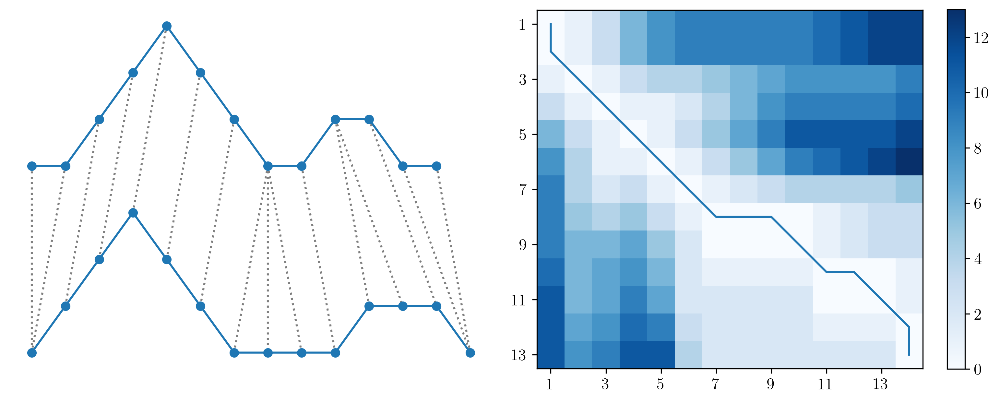

DTW-C++
===========================

 

There is separate [detailed documentation](https://Battery-Intelligence-Lab.github.io/dtw-cpp/) available for this project; this `readme.md` file only gives a short summary. 

Introduction
===========================
DTW-C++ is a dynamic time warping (DTW) and clustering library for time series data, written in C++. Users can input multiple time series and find clusters of similar time series. Time series may be the same lengths, or different lengths. The number of clusters to find may be fixed, or a range of numbers to try may be specified. DTW-C++ finds clusters in time series data using k-medoids or mixed integer programming (MIP); k-medoids is generally faster, but may get stuck in local optima; MIP can find globally optimal clusters.

Contributors
===========================
<!-- ALL-CONTRIBUTORS-LIST:START - Do not remove or modify this section --><!-- prettier-ignore-start --><!-- markdownlint-disable -->
<table>
	<tbody>
		<tr>
			<td style="text-align:center; vertical-align:top"><a href="https://github.com/beckyperriment"> 
			<strong>Becky Perriment</strong></a> 
			<a href="https://github.com/Battery-Intelligence-Lab/dtw-cpp/blob/main/develop/contributors.md#core-contributors">💡💻👀⚠️</a></td>
			<td style="text-align:center; vertical-align:top"><a href="https://github.com/ElektrikAkar"> 
			<strong>Volkan Kumtepeli</strong></a> 
			<a href="https://github.com/Battery-Intelligence-Lab/dtw-cpp/blob/main/develop/contributors.md#core-contributors">💡💻👀⚠️🚇🐢</a></td>
			<td style="text-align:center; vertical-align:top"><a href="http://howey.eng.ox.ac.uk"> 
			<strong>David Howey</strong></a> 
			<a href="https://github.com/Battery-Intelligence-Lab/dtw-cpp/blob/main/develop/contributors.md#core-contributors">💡👀</a></td>
		</tr>
	</tbody>
</table>
<!-- markdownlint-restore --><!-- prettier-ignore-end --><!-- ALL-CONTRIBUTORS-LIST:END -->
