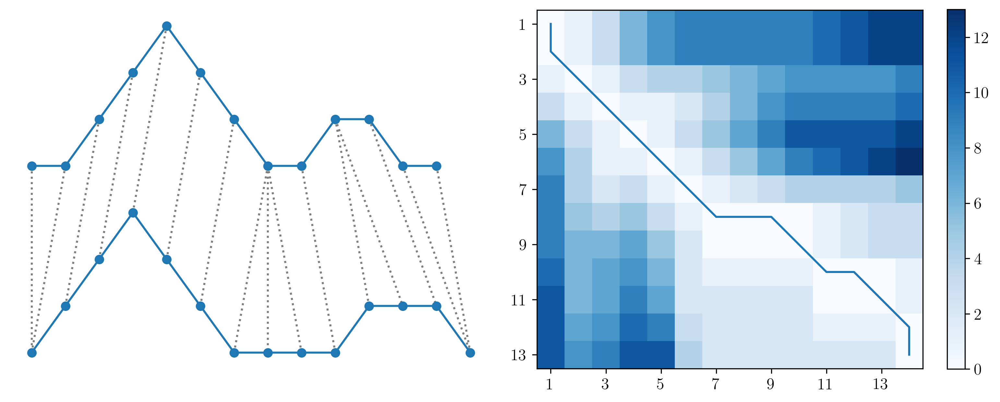

DTW-C++
===========================
[](https://doi.org/10.21105/joss.06881)
[](https://doi.org/10.5281/zenodo.13551469)
[](https://Battery-Intelligence-Lab.github.io/dtw-cpp/)


[](https://github.com/Battery-Intelligence-Lab/dtw-cpp/actions)
[](https://github.com/Battery-Intelligence-Lab/dtw-cpp/actions)
[](https://github.com/Battery-Intelligence-Lab/dtw-cpp/actions)
[](https://github.com/Battery-Intelligence-Lab/dtw-cpp/actions/workflows/python-tests.yml)
[](https://codecov.io/gh/Battery-Intelligence-Lab/dtw-cpp)


 
[](https://github.com/Battery-Intelligence-Lab/dtw-cpp/blob/main/LICENSE)

There is separate [detailed documentation](https://Battery-Intelligence-Lab.github.io/dtw-cpp/) available for this project; this `readme.md` file only gives a short summary. 

Introduction
===========================
DTW-C++ is a high-performance C++ library for Dynamic Time Warping (DTW) distance computation and time series clustering, with Python and MATLAB bindings.

**Key features:**

- **5 DTW variants**: Standard, Derivative (DDTW), Weighted (WDTW), Amerced (ADTW), Soft-DTW
- **Missing data support**: NaN-aware DTW (DTW-AROW)
- **3 clustering algorithms**: FastPAM k-medoids, FastCLARA (scalable), MIP (globally optimal)
- **LB pruning**: LB_Kim + LB_Keogh early-abandon for 9-11x faster distance matrices
- **Multi-language**: C++ core, Python (sklearn-compatible), MATLAB MEX bindings
- **Parallelism**: OpenMP threads, MPI distributed, CUDA GPU (optional)
- **Checkpointing**: Save/resume long-running distance matrix computations
- **I/O**: CSV, HDF5, Parquet formats (Python)

**Performance**: Beats aeon by 12x and dtaidistance by 1.7x on pairwise distance matrix construction. Full end-to-end clustering is 42x faster than aeon/tslearn.
<p align="center"></center></p>

Installation
===========================

### C++ (CMake)

```bash
cmake -S . -B build -DDTWC_BUILD_TESTING=ON
cmake --build build --config Release -j
cd build && ctest -C Release
```

### Python

```bash
pip install .          # install from source
# or for development:
pip install -e ".[test]"
pytest tests/python/ -v
```

### Optional dependencies

**MPI** (distributed distance matrix across multiple nodes):

```bash
# Linux
sudo apt install libopenmpi-dev openmpi-bin

# macOS
brew install open-mpi

# Windows: download MS-MPI from
# https://learn.microsoft.com/en-us/message-passing-interface/microsoft-mpi
# Install BOTH msmpisetup.exe (runtime) AND msmpisdk.msi (SDK)

# Build with MPI
cmake -S . -B build -DDTWC_ENABLE_MPI=ON -DDTWC_BUILD_TESTING=ON
cmake --build build --config Release -j
mpiexec -n 4 ./build/bin/unit_test_mpi
```

**CUDA** (GPU-accelerated batch DTW):

```bash
# Linux
sudo apt install cuda-toolkit-12-6  # or download from nvidia.com

# Windows: download CUDA Toolkit from
# https://developer.nvidia.com/cuda-downloads

# Verify
nvcc --version
nvidia-smi

# Build with CUDA
cmake -S . -B build -DDTWC_ENABLE_CUDA=ON
cmake --build build --config Release -j
```

**MATLAB** (MEX bindings):

```bash
cmake -S . -B build -DDTWC_BUILD_MATLAB=ON
cmake --build build --config Release -j
# Requires MATLAB with C++ MEX compiler configured
```

### All CMake options

| Option | Default | Description |
|--------|---------|-------------|
| `DTWC_BUILD_TESTING` | OFF | Build unit tests (Catch2) |
| `DTWC_BUILD_BENCHMARK` | OFF | Build benchmarks (Google Benchmark) |
| `DTWC_BUILD_PYTHON` | OFF | Build Python bindings (nanobind) |
| `DTWC_BUILD_MATLAB` | OFF | Build MATLAB MEX bindings |
| `DTWC_ENABLE_MPI` | OFF | Enable MPI distributed computing |
| `DTWC_ENABLE_CUDA` | OFF | Enable CUDA GPU acceleration |
| `DTWC_ENABLE_GUROBI` | ON | Enable Gurobi MIP solver (optional) |
| `DTWC_ENABLE_HIGHS` | ON | Enable HiGHS MIP solver (optional) |
| `DTWC_ENABLE_SIMD` | OFF | Enable Highway SIMD (experimental) |

Citation
===========================

APA style: 
```
Kumtepeli, V., Perriment, R., & Howey, D. A. (2024). DTW-C++: Fast dynamic time warping and clustering of time series data. Journal of Open Source Software, 9(101), 6881. https://doi.org/10.21105/joss.06881
```

BibTeX: 
```
@article{Kumtepeli2024,
author = {Kumtepeli, Volkan and Perriment, Rebecca and Howey, David A.},
doi = {10.21105/joss.06881},
journal = {Journal of Open Source Software},
month = sep,
number = {101},
pages = {6881},
title = {{DTW-C++: Fast dynamic time warping and clustering of time series data}},
url = {https://joss.theoj.org/papers/10.21105/joss.06881},
volume = {9},
year = {2024}
}
```

Contributors
===========================
<!-- ALL-CONTRIBUTORS-LIST:START - Do not remove or modify this section --><!-- prettier-ignore-start --><!-- markdownlint-disable -->
<table>
	<tbody>
		<tr>
			<td style="text-align:center; vertical-align:top"><a href="https://github.com/beckyperriment"><br />
			<sub><strong>Becky Perriment</strong></sub></a><br />
			<a href="https://github.com/Battery-Intelligence-Lab/dtw-cpp/blob/main/develop/contributors.md#core-contributors">💡💻👀⚠️</a></td>
			<td style="text-align:center; vertical-align:top"><a href="https://github.com/ElektrikAkar"><br />
			<sub><strong>Volkan Kumtepeli</strong></sub></a><br />
			<a href="https://github.com/Battery-Intelligence-Lab/dtw-cpp/blob/main/develop/contributors.md#core-contributors">💡💻👀⚠️🚇🐢</a></td>
			<td style="text-align:center; vertical-align:top"><a href="http://howey.eng.ox.ac.uk"><br />
			<sub><strong>David Howey</strong></sub></a><br />
			<a href="https://github.com/Battery-Intelligence-Lab/dtw-cpp/blob/main/develop/contributors.md#core-contributors">💡👀</a></td>
		</tr>
	</tbody>
</table>
<!-- markdownlint-restore --><!-- prettier-ignore-end --><!-- ALL-CONTRIBUTORS-LIST:END -->
