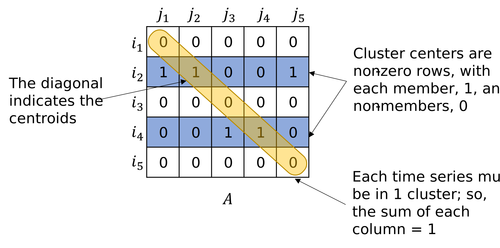

# Clustering Method

Mixed integer programming (MIP) can be used on a completed DTW distance matrix to cluster the data series. The output provides both the members of each cluster, where the number of clusters, $$k$$, is determined by the user. Each cluster is represented by a centroid, which is the member of the cluster the reduces the overall cost.

All pairwise DTW distances are stored in a separate symmetric matrix, $$(D^{p\times p})$$, where $$p$$ is the total number of time series in the clustering exercise. In other words, the element $$d_{i,j}$$ gives the distance between time series $$i$$ and $$j$$.

Using this matrix, $$D$$, the time series can be split into $$k$$ separate clusters with integer programming. The problem formulation begins with a binary square matrix $$A^{p\times p}$$, where $$A_{ij}=1$$ if time series $$j$$ is a member of the $$i$$ th cluster centroid, and 0 otherwise, as shown below.

As each centroid has to be in its own cluster, non-zero diagonal entries in  $$A$$ represent centroids. In summary, the following constraints apply: 

1. Only $$k$$ series can be centroids,

   $$\sum_{i=1}^p A_{ii}=k$$

2. Each time series must be in one and only one cluster,

   $$\sum_{i=1}^pA_{ij}=1  \quad \forall j \in [1,p]$$

5. In any row, there can only be non-zero entries if the corresponding diagonal entry is non-zero, so a time series can only be in a cluster where the row corresponds to a centroid time series,
  
   $$A_{ij} \le A_{ii} \quad \forall i,j \in [1,p]$$

The optimisation problem to solve, subject to the above constraints, is

$$
A^{*} = \min_{A} \sum_i \sum_j D_{ij} \times A_{ij}.
$$

After solving this integer program, the non-zero diagonal entries of $$A$$ represent the centroids, and the non-zero elements in the corresponding columns in $$A$$ represent the members of that cluster. In the example below, the clusters are time series 1, **2**, 5 and 3, **4** with the bold time series being the centroids.Example output from the clustering process, where an entry of 1 indicates that time series $$j$$ belongs to cluster with centroid i: 

Finding global optimality can increase the computation time, depending on the number of time series within the dataset and the DTW distances. Therefore, there is also a built-in option to cluster using k-medoids. The k-medoids method is often quicker as it is an iterative approach, however it is subject to getting stuck in local optima. The results in the next section show the timing and memory performance of both MIP clustering and k-medoids clustering using *DTW-C++* compared to other packages.

