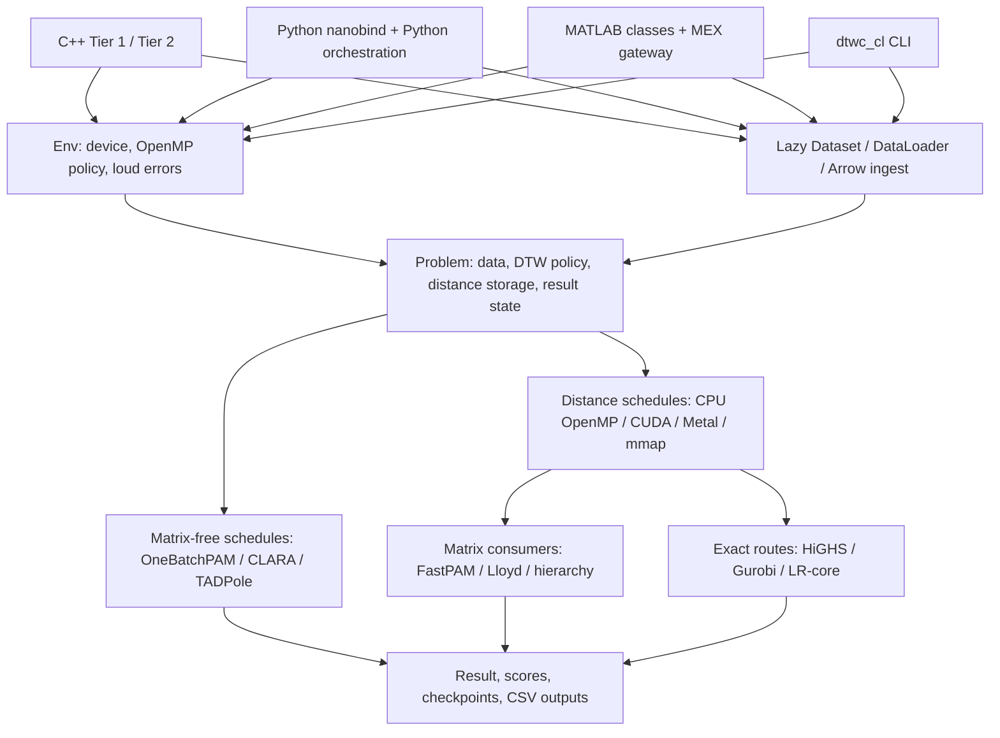

# Architecture

The language surfaces converge on one C++ core. Device and method validation
happen before expensive work; algorithms write their result back into `Problem`,
so Tier-1 results and Tier-2 scores observe the same state.

The important scaling decision is the branch after `Problem`: changing file
format reduces ingestion cost, while choosing a matrix-free algorithm avoids the
quadratic distance matrix itself.
