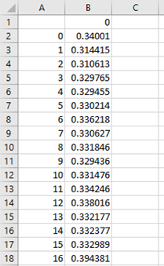

<!--{:width="80%" }-->


# About DTWpp

_DTWpp_ is a package for time series analysis and clustering. The algorithm ultisies dynamic time warping (DTW) as a distance metric to compare the similarity of input time series. To perform clustering of the time series, mixed integer programming (MIP) is performed on the distance matrix, comparing all time series.

The availability of time series data is rapdily increasing, and analysing and clustering the raw time series data can provide great insights into the data without inflicting biases by extracting features. However clustering time series can become very complex due to their potentially large size, variable lengths and shifts in the time axis. DTW is a powerful distance metric that can compare time series of varying lengths, while allowing shifts in the time axis to recognise similarity between time series even when the events are not at identical time stamps. For further infromation on DTW,  see [Dynamic Time Warping](../2_method/2_dtw.html).

This code has been developed at the Department of Engineering Science of the University of Oxford. 
For information about our battery research, visit the [Battery Intelligence Lab](https://howey.eng.ox.ac.uk) website. 

For more information and comments, please contact 
[rebecca.perriment@eng.ox.ac.uk](rebecca.perriment@eng.ox.ac.uk).


# Requirements

You will need a C++ programming environment to edit, compile and run the code.
Visual Studio Code is the environment used to develop the code, but other environments should work as well. Within Visual Studio Code, the extention C++ CMake tools for Windows is required.
Your computer must also have a C++ compiler installed.
The code has been tested using Clang.
Extensive guidelines on how to install those programs is provided in the documentation.

To run the MIP clustering, you will need to have installed MATLAB. 
The code has been tested using MATLAB R2020a, but should work with other releases with no or minor modifications.

 
# Installation

### Option 1 - Downloading a .zip file ###
[Download a .zip file of the code](https://github.com/Battery-Intelligence-Lab/DTWpp/archive/refs/heads/main.zip)

Then, unzip the folder in a chosen directory on your computer.

### Option 2 - Cloning the repository with Git ###
To clone the repository, you will first need to have Git installed on 
your computer. Then, navigate to the directory where you want to clone the 
repository in a terminal, and type:
```bash
git clone https://github.com/Battery-Intelligence-Lab/DTWpp.git
```
The folder containing all the files should appear in your chosen directory.


# Getting started

Once the code is imported into the programming environment, there are several options within the code that can be altered for your requirements. These are detailed as follows:
- Path to read csv files from, *main.cpp line 29*.
-  To change the number of times the k-medoids algorithm is run with different initial conditions, *settings.hpp line 17*.
-  To change the maximum iterations for each run of the k-medoids algorithm , *settings.hpp line 18*.
-  To change the number of csv files read from the folder (i.e. how many data series you're clustering), *main.cpp line 30*.
-  To change the number of clusters, *main.cpp line 31*.
-  To use the csv filenames in the results, *settings.hpp, line 15*. Otherwise, series will be labelled 1 to x in order of being read from the folder.
-  To decrease the runtime of the code, it is possible to store all the DTW distances as you repeatedly run the code and then this matrix of DTW distances can be read each time rather than recalculating. To do this, uncomment *main.cpp, line 42* but ensure you comment out again if changing the data read.
-  To change the warping window, *main.cpp line 48*. If no warping window is desired, the dtwFun2 function can be called in place of the dtwFunBanded_Act function.
-  To calculate the entire DTW distance matrix (required for the MIP), uncomment *main.cpp line 90*.


# Inputs

It should be noted that in its current version the code only allows inputs in a specific format, as described below and shown in MS Excel for visual clarity:
-  CSV format.
-  First column [blank, 0, ..., n-1] where _n_ is the length of the data series.
-  Second column [0, data[1], ..., data[n]].
-  If desired, the csv filename can be used as a label for the data series.

{:width="20%" }

# Outputs

-  All outputs go in the 'results' folder.
-  'DTWdist_band_all' is the DTW matrix for each data series to every other data series.
-  'dataOrder' shows which csv file links to which respective row/column in the 'DTWdist_band_all' matrix.
