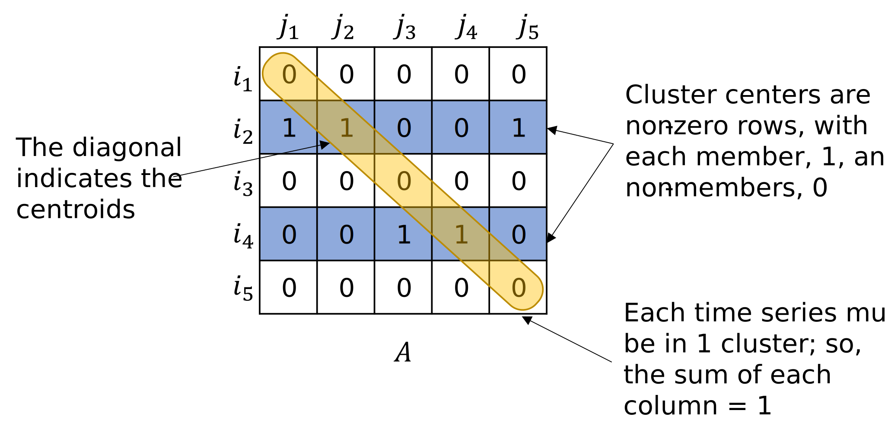

# Summary

Time-series data analysis is of interest in a huge number of different applications, from finding patterns of energy consumption, to detecting brain activity, to discovering stock price trends. Unsupervised learning methods can help analysts unlock patterns in data, and an important example method is clustering. However, clustering of time series data can be computationally expensive for large datasets. We present an approach for computationally efficient dynamic time warping (DTW) and clustering of time-series data. The method frames the dynamic warping of time series datasets as an optimisation problem solved using dynamic programming, and then clusters time series data by solving a second optimisation problem using mixed-integer programming (MIP). There is also an option to use k-medoids clustering for increased speed, when a certificate for global optimality is not essential. The increased speed of our approach is due to task-level parallelisation and memory efficiency improvements. The approach was tested using the UCR Time Series Archive, and was found to be on average 33% faster than the next fastest option when using the same clustering method. This increases to 64% faster when considering only larger datasets (with more than 1000 time series). The MIP clustering is most effective on small numbers of longer time series, because the DTW computation is faster than other approaches, but the clustering problem becomes increasingly computationally expensive as the number of time series increases.

# Statement of need

The target audience for this software is very broad---basically, anyone interested in analysing time series data. Clustering of time series data is of interest across a very broad range of applications, from energy to finance and medicine. However, as data availability increases, so does the complexity of the clustering problem. Most time series clustering algorithms depend on dimension reduction or feature extraction techniques to enable scaling to large datasets, but this can induce bias in the clustering [@Aghabozorgi2015]. Dynamic time warping [@Sakoe1978] is a well-known technique for manipulating time series to enable comparisons between datasets, using local warping (stretching or compressing along the time axis) of the elements within each time series to find an optimal alignment between series. This emphasises the similarity of the shapes of the respective time series rather than the exact alignment of specific features. Unfortunately, DTW does not scale well in computational speed as the length and number of time series to be compared increases---the computational complexity grows quadratically with the total number of data points. This is a barrier to DTW being widely implemented in large-scale time series clustering  [@Rajabi2020]. In response, `DTW-C++` was written to handle large time series datasets efficiently, directly processing the raw data rather than first extracting features or reduced-dimension data. 

In contrast to existing tools available for time series clustering using DTW, such as `DTAIDistance` [@meert2020wannesm] and `TSlearn` [@Tavenard2020], `DTW-C++` offers significant improvements in speed and memory use, enabling larger datasets to be clustered. This is achieved by

1. task-level parallelisation, where multiple pairwise comparisons between time series can be evaluated simultaneously, and,
2. improved memory management---since the clustering algorithm only needs the final distance computed between pairwise time series, the DTW distance computation stores only the most recent previous vector, rather than the entire warping matrix.

In addition, `DTW-C++` offers the option of clustering using a new algorithm (described below) based on MIP. The advantage of this over k-based methods is that it guarantees finding a global optimal solution in most cases,  and in the rare event that the global optimum cannot be found, the gap between the best solution found, and the global optimum is given.

# Current ``DTW-C++`` functionality

The current functionality of the software is as follows:

* Calculate DTW pairwise distances between time series, using a vector based approach, to reduce memory use. There is also the option to use a Sakoe-Chiba band to restrict warping in the DTW distance calculation [@Sakoe1978]. This speeds up the computation time, as well as being a useful constraint for some time series clustering scenarios (e.g., if an event must occur within a certain time window to be considered similar).
* Produce a distance matrix containing all pairwise comparisons between each time series in the dataset.
* Split all time series into a predefined number of clusters, with a representative centroid time series for each cluster. This can be done using MIP or k-medoids clustering, depending on user choice.
* Output the clustering cost, which is the sum of distances between every time series within each cluster and its cluster centroid.
* Find the silhouette score and elbow score for the clusters in order to aid the user decision on how many clusters, $k$, to include.

# Mathematical background

Consider a time series to be a vector of some arbitrary length. Consider that we have $p$ such vectors in total, each possibly differing in length. To find a subset of $k$ clusters within the set of $p$ vectors using MIP formulation, we must first make $\frac{1}{2} {p \choose 2}$ pairwise comparisons between all vectors within the total set and find the `similarity' between each pair. In this case, the similarity is defined as the DTW distance. Consider two time series $x$ and $y$ of differing lengths $n$ and $m$ respectively,

$$
x=(x_1, x_2, ..., x_n)
$$
$$
y=(y_1, y_2, ..., y_m).
$$

The DTW distance is the sum of the Euclidean distance between each point and its matched point(s) in the other vector, as shown in \autoref{fig:warping_signals}. The following constraints must be met:

1. The first and last elements of each series must be matched.
2. Only unidirectional forward movement through relative time is allowed, i.e., if $x_1$ is mapped to $y_2$ then $x_2$ may not be mapped to
    $y_1$ (monotonicity). 
3. Each point is mapped to at least one other point, i.e., there are no jumps in time (continuity).

Finding the optimal warping arrangement is an optimisation problem that can be solved using dynamic programming, which splits the problem into easier sub-problems and solves them recursively, storing intermediate solutions until the final solution is reached. To understand the memory-efficient method used in ``DTW-C++``, it is useful to first examine the full-cost matrix solution, as follows. For each pairwise comparison, an $n$ by $m$ matrix $C^{n\times m}$ is calculated, where each element represents the cumulative cost between series up to the points $x_i$ and $y_j$:

\begin{equation}
    \label{c}
    c_{i,j} = (x_i-y_j)^2+\min\begin{cases}
    c_{i-1,j-1}\\
    c_{i-1,j}\\
    c_{i,j-1}
    \end{cases}
\end{equation}

The final element $c_{n,m}$ is then the total cost, $C_{x,y}$, which provides the comparison metric between the two series $x$ and $y$. \autoref{fig:warping_signals} shows an example of this cost matrix $C$ and the warping path through it.

For the clustering problem, only this final cost for each pairwise comparison is required; the actual warping path (or mapping of each point in one time series to the other) is superfluous for k-medoids clustering. The memory complexity of the cost matrix $C$ is $O(nm)$, so as the length of the time series increases, the memory required increases greatly. Therefore, significant reductions in memory can be made by not storing the entire $C$ matrix. When the warping path is not required, only a vector containing the previous row for the current step of the dynamic programming sub-problem is required (i.e., the previous three values $c_{i-1,j-1}$, $c_{i-1,j}$, $c_{i,j-1}$), as indicated in \autoref{c}.

The DTW distance $C_{x,y}$ is found for each pairwise comparison. As shown in \ref{fig:c_to_d}, pairwise distances are then stored in a separate symmetric matrix, $D^{p\times p}$, where $p$ is the total number of time series in the clustering exercise. In other words, the element $d_{i,j}$ gives the distance between time series $i$ and $j$.

Using this matrix, $D$, the time series can be split into $k$ separate clusters with integer programming. The problem formulation begins with a binary square matrix $A^{p\times p}$, where $A_{ij}=1$ if time series $j$ is a member of the $i$th cluster centroid, and 0 otherwise, as shown in \autoref{fig:A_matrix}.

{ width=70% }

As each centroid has to be in its own cluster, non-zero diagonal entries in  $A$ represent centroids. In summary, the following constraints apply: 

1. Only $k$ series can be centroids,

$$
\sum_{i=1}^p A_{ii}=k.
$$

2. Each time series must be in one and only one cluster,

$$
\sum_{i=1}^pA_{ij}=1  \quad \forall j \in [1,p].
$$

3. In any row, there can only be non-zero entries if the corresponding diagonal entry is non-zero, so a time series can only be in a cluster where the row corresponds to a centroid time series,

$$
A_{ij} \le A_{ii} \quad \forall i,j \in [1,p].
$$

The optimisation problem to solve, subject to the above constraints, is

\begin{equation}
    A^\star = \min_{A} \sum_i \sum_j D_{ij} \times A_{ij}.
\end{equation}

This integer program is solved using Gurobi [@gurobi] or HiGHS [@Huangfu2018]. After solving this integer program, the non-zero diagonal entries of $A$ represent the centroids, and the non-zero elements in the corresponding columns in $A$ represent the members of that cluster. In the example in \autoref{fig:A_matrix}, the clusters are time series 1, **2**, 5 and 3, **4** with the bold time series being the centroids.

Finding global optimality can increase the computation time, depending on the number of time series within the dataset and the DTW distances. Therefore, there is also a built-in option to cluster using k-medoids, as used in other packages such as \texttt{DTAIDistance} [@meert2020wannesm]. The k-medoids method is often quicker as it is an iterative approach, however it is subject to getting stuck in local optima. The results in the next section show the timing and memory performance of both MIP clustering and k-medoids clustering using \texttt{DTW-C++} compared to other packages.

# Comparison

We compared our approach with two other DTW clustering packages, \texttt{DTAIDistance} [@meert2020wannesm] and \texttt{TSlearn} [@Tavenard2020]. The datasets used for the comparison are from the UCR Time Series Classification Archive [@Dau2018], and consist of 128 time series datasets with up to 16,800 data series of lengths up to 2,844. The full results can be found in the Appendix. Benchmarking against  \texttt{TSlearn}  was stopped after the first 22 datasets because the results were consistently over 20 times slower than \texttt{DTW-C++}. \autoref{tab:small_table} shows the results for datasets downselected to have a number of time series ($N$) greater than 100 and a length of each time series greater than 500 points. This is because \texttt{DTW-C++} is aimed at larger datasets where the speed improvements are more relevant.

\begin{table}[]
\resizebox{\textwidth}{!}{%
\begin{tabular}{l|p{.125\textwidth}p{.125\textwidth}p{.125\textwidth}p{.125\textwidth}p{.125\textwidth}p{.125\textwidth}}
                           & Number of time series    & Length of time series    & DTW-C++ MIP (s) & DTW-C++ k-Medoids (s) & DTAI Distance (s) & Time decrease (\%) \\
\hline
CinCECGTorso               & 1380 & 1639 & 3008.4      & \textbf{1104.2}   & 1955.9       & 44                 \\
Computers                  & 250  & 720  & 16.1        & \textbf{10.5}     & 12.8         & 18                 \\
Earthquakes                & 139  & 512  & 3.2         & \textbf{2.4}      & 2.5          & 3                  \\
EOGHorizontalSignal        & 362  & 1250 & 81.8        & \textbf{27.6}     & 82.9         & 67                 \\
EOGVerticalSignal          & 362  & 1250 & 85.9        & \textbf{30.2}     & 85.2         & 65                 \\
EthanolLevel               & 500  & 1751 & 325.7       & \textbf{198.9}    & 302.3        & 34                 \\
HandOutlines               & 370  & 2709 & 383.7       & \textbf{280.9}    & 415.9        & 32                 \\
Haptics                    & 308  & 1092 & 65.5        & \textbf{24.0}     & 45.5         & 47                 \\
HouseTwenty                & 119  & 2000 & 23.8        & \textbf{19.1}     & 22.0         & 13                 \\
InlineSkate                & 550  & 1882 & 412.4       & \textbf{198.9}    & 423.4        & 53                 \\
InsectEPGRegularTrain      & 249  & 601  & 12.3        & \textbf{5.6}      & 8.9          & 37                 \\
InsectEPGSmallTrain        & 249  & 601  & 11.6        & \textbf{5.3}      & 8.9          & 41                 \\
LargeKitchenAppliances     & 375  & 720  & 44.6        & \textbf{25.6}     & 31.8         & 20                 \\
Mallat                     & 2345 & 1024 & 2948.7      & \textbf{517.0}    & 2251.3       & 77                 \\
MixedShapesRegularTrain    & 2425 & 1024 & 2811.8      & \textbf{1221.9}   & 2367.1       & 48                 \\
MixedShapesSmallTrain      & 2425 & 1024 & 2793.7      & \textbf{934.0}    & 2369.3       & 61                 \\
NonInvasiveFetalECGThorax1 & 1965 & 750  & 52599.0     & \textbf{128.7}    & 941.9        & 86                 \\
NonInvasiveFetalECGThorax2 & 1965 & 750  & 4905.4      & \textbf{115.6}    & 951.0        & 88                 \\
Phoneme                    & 1896 & 1024 & 46549.0     & \textbf{198.4}    & 1560.6       & 87                 \\
PigAirwayPressure          & 208  & 2000 & 84.6        & \textbf{56.7}     & 73.2         & 23                 \\
PigArtPressure             & 208  & 2000 & 78.9        & \textbf{41.8}     & 71.1         & 41                 \\
PigCVP                     & 208  & 2000 & 73.5        & \textbf{51.7}     & 69.5         & 26                 \\
RefrigerationDevices       & 375  & 720  & 36.8        & \textbf{20.3}     & 28.4         & 28                 \\
ScreenType                 & 375  & 720  & 38.6        & \textbf{16.1}     & 28.5         & 43                 \\
SemgHandGenderCh2          & 600  & 1500 & 335.9       & \textbf{315.2}    & 325.4        & 3                  \\
SemgHandMovementCh2        & 450  & 1500 & 177.7       & \textbf{107.2}    & 181.1        & 41                 \\
SemgHandSubjectCh2         & 450  & 1500 & 186.4       & \textbf{96.7}     & 177.6        & 46                 \\
ShapesAll                  & 600  & 512  & 67.5        & \textbf{15.1}     & 44.4         & 66                 \\
SmallKitchenAppliances     & 375  & 720  & 41.7        & \textbf{23.8}     & 30.1         & 21                 \\
StarLightCurves            & 8236 & 1024 & N/A         & \textbf{18551.7}  & 27558.1      & 33                 \\
UWaveGestureLibraryAll     & 3582 & 945  & N/A         & \textbf{1194.6}   & 4436.9       & 73                
\end{tabular}}
\caption{Computational time comparison of \texttt{DTW-C++} using MIP and k-medoids, vs.\ \texttt{DTAIDistance}, and \texttt{TSlearn}, on datasets in the UCR Time Series Classification Archive where $N>100$ and $L>500$.}
\label{tab:small_table}
\end{table}

As can be seen in these results, \texttt{DTW-C++} is the fastest package for 90\% of the datasets, and all 13 datasets where \texttt{DTAIDistance} was faster were cases where the entire clustering process was completed in 1.06 seconds or less. Across the whole collection of datasets, \texttt{DTW-C++} was on average 32% faster. When looking at larger datasets with $N > 1000$, \texttt{DTW-C++} is on average 65% faster. In all, apart from 2 of the 115 cases where \texttt{DTW-C++} is the fastest, it uses the k-medoids algorithm. This is however to be expected as the latter is an iterative clustering method and therefore does not compute all DTW distances. \autoref{fig:k_med} clearly shows the increasing superiority of \texttt{DTW-C++} as the number of time series increases. In this comparison, both algorithms use k-medoids, so the speed improvement is due to faster dynamic time warping.

\texttt{DTW-C++} MIP was on average 16 times slower than \texttt{DTAIDistance} over all samples and as the number of time series increases, MIP clustering becomes increasingly slower. This is to be expected because the computational complexity of the MIP clustering optimisation increases significantly as the number of time series in the clustering problem increases. However, as the length of the time series increases, the performance of MIP converges to the speed of \texttt{DTAIDistance}, while finding global optimality. This confirms the improved performance of DTW in \texttt{DTW-C++}. Therefore, the MIP approach is recommended for occasions when the time series to be clustered are very long, but the number of time series is smaller.

The comparison of all datasets in the UCR Time Series Classification Archive can be found in reference [@kumtepeli2023fast].

{ width=80% }

# Acknowledgements

We gratefully acknowledge the contributions by [Battery Intelligence Lab](https://howey.eng.ox.ac.uk) members, and thank BBOXX for project funding and access to data. This work was also funded by the UKRI PFER Energy Superhub Oxford demonstrator and the ``Data-driven exploration of the carbon emissions impact of grid energy storage deployment and dispatch'' project (EP/W027321/1).

# References

