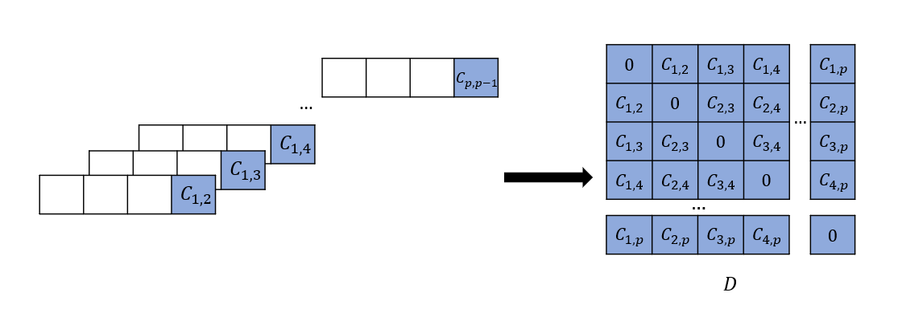

# Summary

Disclaimer: paper writing is still ongoing; please do not use this version as a reference. 

We present an approach for computationally efficient dynamic time warping (DTW) and clustering of time-series data. The method frames the dynamic warping of time series datasets as an optimisation problem solved using dynamic programming, and then clusters time series data by solving a second optimisation problem using mixed-integer programming (MIP). There is also an option to use k-medoids clustering for increased speed, when a certificate for global optimality is not essential. The improved efficiency of our approach is due to task-level parallelisation of the clustering alongside DTW. Our approach was tested using the UCR Time Series Archive, and was found to be, on average, 33% faster than the next fastest option when using the same clustering method. This increases to 64% faster when considering only larger datasets (with more than 1000 time series). The MIP clustering is most effective on small numbers of longer time series, because the DTW computation is faster than other approaches, but the clustering problem becomes increasingly computationally expensive as the number of time series to be clustered increases.

# Statement of need

Clustering time series is becoming increasingly popular as data availability increases; however as the data avilability increases, so does the complexity of the clustering problem. Most time series clustering objectives currently depend on dimension reduction techniques or finding features from the time series which can induce bias into the clustering [@Aghabozorgi2015]. Time series clustering applications range from energy to find consumption patterns, to detecting brainactivity in medical applications, to discovering patterns in stock price trends in the fincance industry. ``DTW-C++`` is written to handle large time series datasets, working on the raw data rather than reduced dimension data or selected features from the time series, across the various applications. The target audience for this software can therefore range acorss multiple disciplines, intended for any user with a requirement for time-series clustering.

While there are other packages available for time series clustering using DTW, namely [@Petitjean2011] and [@meert2020wannesm], ``DTW-C++`` offers signficant imporvements in both speed and memory use, allowing larger datasets to be clustered. This is done by task level parallelisation, allowing multiple pairwise comparsions between time series to be evaluated simulataneously, as well as more efficient memory management by solving the DTW distance using only the preceding vector rather than storing the entire warping matrix. This means that the warping path between each time series is not stored, but this is not required for the clustering process - only the final cost is needed. In addition, MIP is preferable to other DTW clustering packages which use k-based methods for clustering, as k-based methods are suseptible to sticking in local optima. MIP finds the global optimum in most cases, and in the rare event that the global optimum is not found, the gap between the best solution found and the global optimum is given.

# Current ``DTW-C++`` functionality

The current functionality of the software is as follows:
* Calculate DTW pairwise distances between time series, using a vector based approach to reduce memory use. There is also the option to use a Sakoe-Chiba band to restrict warping in the DTW distance calculation [@Sakoe1978DynamicRecognition]. This speeds up the computation time as well as being a useful constraint for some time series clustering scenarios (e.g., if an event must occur within a certain time window to be considered similar).
* Produce a distance matrix containing all pairwise comparisons between each time series in the dataset.
* Split all time series into a predefined number of clusters, with a representative centroid time series for each cluster. This can be done using MIP or k-medoids clustering, depending on user choice.
* Output the clustering cost, which is the sum of distances between every time series within each cluster and its cluster centroid.
* Find the silhouette score and elbow score for the clusters in order to aid the user decision on how many clusters, $k$, to include.

# Mathmatical background

Consider a time series to be a vector of some arbitrary length. Consider that we have \(p\) such vectors in total, each possibly differing in length. To find a subset of \(k\) clusters within the set of \(p\) vectors using MIP formulation, we must first make $\frac{1}{2} {p \choose 2}$ pairwise comparisons between all vectors within the total set and find the `similarity' between each pair. In this case, the similarity is defined as the DTW distance. Consider two time series \(x\) and \(y\) of differing lengths \(n\) and \(m\) respectively,

$$
x=(x_1, x_2, ..., x_n)
$$
$$
y=(y_1, y_2, ..., y_m).
$$

The DTW distance is the sum of the Euclidean distance between each point and its matched point(s) in the other vector, as shown in Fig.\ \autoref{fig:warping_signals}. The following constraints must be met: 

1. The first and last elements of each series must be matched.
2. Only unidirectional forward movement through relative time is allowed, i.e., if $x_1$ is mapped to $y_2$ then $x_2$ may not be mapped to
    $y_1$ (monotonicity). 
3. Each point is mapped to at least one other point, i.e., there are no jumps in time (continuity).

Finding the optimal warping arrangement is an optimisation problem that can be solved using dynamic programming, which splits the problem into easier sub-problems and solves them recursively, storing intermediate solutions until the final solution is reached. To understand the memory-efficient method used in ``DTW-C++``, it is useful to first examine the full-cost matrix solution, as follows. For each pairwise comparison, an \(n\) by \(m\) matrix \(C^{n\times m}\) is calculated, where each element represents the cumulative cost between series up to the points \(x_i\) and \(y_j\):

\begin{equation}
    \label{c}
    c_{i,j} = (x_i-y_j)^2+\min\begin{cases}
    c_{i-1,j-1}\\
    c_{i-1,j}\\
    c_{i,j-1}
    \end{cases}
\end{equation}

The final element \(c_{n,m}\) is then the total cost, $C_{x,y}$, which provides the comparison metric between the two series $x$ and $y$. Fig.\ \autoref{fig:warping_signals} shows an example of this cost matrix $C$ and the warping path through it.

For the clustering problem, only this final cost for each pairwise comparison is required; the actual warping path (or mapping of each point in one time series to the other) is superfluous for k-medoids clustering. The memory complexity of the cost matrix $C$ is $O(nm)$, so as the length of the time series increases, the memory required increases greatly. Therefore, significant reductions in memory can be made by not storing the entire $C$ matrix. When the warping path is not required, only a vector containing the previous row for the current step of the dynamic programming sub-problem is required (i.e., the previous three values $c_{i-1,j-1}$, $c_{i-1,j}$, $c_{i,j-1}$), as indicated in Eq.\ \autoref{c}.

The DTW distance \(C_{x,y}\) is found for each pairwise comparison. As shown in Fig.\ \ref{fig:c_to_d}, pairwise distances are then stored in a separate symmetric matrix, \(D^{p\times p}\), where \(p\) is the total number of time series in the clustering exercise. In other words, the element \(d_{i,j}\) gives the distance between time series \(i\) and \(j\).

Using this matrix, \(D\), the time series can be split into \(k\) separate clusters with integer programming. The problem formulation begins with a binary square matrix \(A^{p\times p}\), where \(A_{ij}=1\) if time series \(j\) is a member of the \(i\)th cluster centroid, and 0 otherwise, as shown in Fig.\ \autoref{fig:A_matrix}.

As each centroid has to be in its own cluster, non-zero diagonal entries in  $A$ represent centroids. In summary, the following constraints apply: 

* Only \(k\) series can be centroids,

$$
\sum_{i=1}^p A_{ii}=k.
$$

* Each time series must be in one and only one cluster,

$$
\sum_{i=1}^pA_{ij}=1  \quad \forall j \in [1,p].
$$

* In any row, there can only be non-zero entries if the corresponding diagonal entry is non-zero, so a time series can only be in a cluster where the row corresponds to a centroid time series,

$$
A_{ij} \le A_{ii} \quad \forall i,j \in [1,p].
$$

The optimisation problem to solve, subject to the above constraints, is

\begin{equation}
    A^\star = \min_{A} \sum_i \sum_j D_{ij} \times A_{ij}.
\end{equation}

After solving this integer program, the non-zero diagonal entries of \(A\) represent the centroids, and the non-zero elements in the corresponding columns in \(A\) represent the members of that cluster. In the example in Fig.\ \autoref{fig:A_matrix}, the clusters are time series 1, **2**, 5 and 3, **4** with the bold time series being the centroids.

Finding global optimality can increase the computation time, depending on the number of time series within the dataset and the DTW distances. Therefore, there is also a built-in option to cluster using k-medoids, as used in other packages such as \texttt{DTAIDistance} [@meert2020wannesm]. The k-medoids method is often quicker as it is an iterative approach, however it is subject to getting stuck in local optima. The results in the next section show the timing and memory performance of both MIP clustering and k-medoids clustering using \texttt{DTW-C++} compared to other packages.

Consider a time series to be a vector of some arbitrary length. Consider that we have $p$ such vectors in total, each possibly differing in length. To find a subset of $k$ clusters within the set of $p$ vectors we must first make $\frac{(^p C_2)}{2}$ pairwise comparisons between all vectors within the total set and find the `similarity' between each pair. This requires a distance metric to be defined, and dynamic time warping uses local warping (stretching or compressing along the time axis) of the elements within each vector to find optimal alignment (i.e., with minimum cost/distance) between each pair of vectors. 

Comparing two short time series $x$ and $y$ of differing lengths $n$ and $m$

$$
x=(x_1, x_2, ..., x_n)
$$

$$
y=(y_1, y_2, ..., y_m).
$$

The cost is the sum of the Euclidean distance between each point and the matched point in the other vector. The following constraints must be met:

* The first and last elements of each series must be matched.
* Only unidirectional forward movement through relative time is allowed, i.e.\ $x_1$ may be mapped to $y_2$ but $x_2$ may not be mapped to $y_1$ (monotonicity).
* Each point is mapped to at least one other point, i.e.\ there are no jumps in time (continuity).

Finding the optimal warping arrangement is an optimisation problem that can be solved using dynamic programming, which splits the problem into easier sub-problems and solves them recursively, storing intermediate solutions until the final solution is reached. For each pairwise comparison, an $n$ by $m$ matrix $C_{n\times m}$ is calculated, where each element represents the cumulative cost between series up to the points $x_i$ and $y_j$:

$$
C_{i,j} = (x_i-y_j)^2+\min\begin{cases}
C_{i-1,j-1}\\
C_{i-1,j}\\
C_{i,j-1}
\end{cases}
$$

The final element $C_{n,m}$ is then the total cost which gives the comparison metric between the two series.

The matrix $C$ is calculated for all pairwise comparisons. The total costs (final element) for each pairwise comparison are stored in a separate symmetric matrix, $D_{p\times p}$ where $p$ is the total number of time series in the clustering exercise. In other words, the element $D_{i,j}$ gives the distance between time series $i$ and $j$.

Using this matrix, $D$, the series can be split into $k$ clusters with integer programming. The problem formulation begins with a $1\times p$ binary vector, $B$, defining if each series is a cluster centroid, in other words for the $i$th element of $B$, 

$$
B_i = \begin{cases}
1, \qquad \text {if centroid}\\
0, \qquad \text {otherwise}
\end{cases}
$$

Only $k$ series can be centroids, therefore

$$
\sum_{i=1}^p B_i=k
$$

A binary square matrix $A_{p\times p}$ is then constructed, where $A_{ij}=1$ if time series $j$ is a member of the $i$ th cluster centroid, and 0 otherwise.

The following constraints apply:

* Only \(k\) series can be centroids,

$$
\sum_{i=1}^p A_{ii}=k.
$$

* Each time series must be in one and only one cluster,

$$
\sum_{i=1}^pA_{ij}=1  \quad \forall j \in [1,p].
$$

* In any row, there can only be non-zero entries if the corresponding diagonal entry is non-zero, so a time series can only be in a cluster where the row corresponds to a centroid time series,

$$
A_{ij} \le A_{ii} \quad \forall i,j \in [1,p].
$$

Then the optimisation problem subject to the above-given constraints becomes:

$$
A^\star, B^\star = \min_{A,B} \sum_i \sum_j D_{ij} \times A_{ij} 
$$

After solving this integer program, the non-zero entries of $B$ represent the centroids and the non-zero elements in the corresponding columns in $A$ represent the members of that cluster. In the example in Figure 3, the clusters are time series 1, **2**, 5 and 3, **4** with the bold time series being the centorids.

Finding global optimality can increase the computation time, depending on the number of time series within the dataset and DTW distances. Therefore there is also a built in feature to cluster using k-Medoids, as is used in other packages such as DTAIDistance (@meert2020wannesm). k-Medoids is often quicker as it is an iterative method, however it is subject to getting stuck in local optima. The table in [Comparison](#comparison) shows the timing and memory performance of both MIP clustering and k-Medoids clustering cmpared to other packages.

# Comparison

We have compared our library to two other standard DTW clustering packages, DTAIDistance and TSlearn. The datasets used are time series from the UCR Time Series Classification Archive (@UCRArchive2018), cosisting of 128 time series datasets with up to 16,800 data series of lengths up to 2,844.
|                                | DTW-C++ MIP |             | DTW-C++ k-Medoids |             | DTAIDistance |             |  TSlearn |             |
|--------------------------------|:-----------:|:-----------:|:-----------------:|:-----------:|:------------:|:-----------:|:--------:|:-----------:|
|                                | Time (s)    | Memory (MB) | Time (s)          | Memory (MB) | Time (s)     | Memory (MB) | Time (s) | Memory (MB) |
| ACSF1                          | 3.90325     |             | 10.038            |             | 14.50846     | 18.13902    | 389.8806 | 1691.47     |
| Adiac                          | 27.3902     |             | 1.26198           |             | 3.874026     | 4.343535    | 172.4454 | 15.57942    |
| AllGestureWiimoteX             | #N/A        |             | 2.08638           |             | #N/A         | #N/A        | #N/A     | #N/A        |
| AllGestureWiimoteY             | #N/A        |             | 2.73356           |             | #N/A         | #N/A        | #N/A     | #N/A        |
| AllGestureWiimoteZ             | #N/A        |             | 1.38316           |             | #N/A         | #N/A        | #N/A     | #N/A        |
| ArrowHead                      | 3.40565     |             | 0.897899          |             | 0.913173     | 1.21913     | 60.84465 | 99.72422    |
| Beef                           | 0.081304    |             | 0.214371          |             | 0.180589     | 0.326922    | 9.44669  | 45.58105    |
| BeetleFly                      | 0.060178    |             | 0.127118          |             | 0.077477     | 0.113983    | 13.51861 | 62.41466    |
| BirdChicken                    | 0.067135    |             | 0.132698          |             | 0.072962     | 0.266185    | 7.080103 | 53.88674    |
| BME                            | 0.983196    |             | 0.231731          |             | 0.245758     | 0.951402    | 28.88994 | 22.68403    |
| Car                            | 0.43974     |             | 0.402418          |             | 0.49119      | 0.577236    | 53.99938 | 236.0967    |
| CBF                            | 259.902     |             | 2.69667           |             | 7.495611     | 18.5782     | 264.24   | 103.3957    |
| Chinatown                      | 10.5725     |             | 0.136138          |             | 0.286097     | 3.085478    | 12.98259 | 2.78981     |
| ChlorineConcentration          | 0           |             | 70.1711           |             | 201.1307     | 305.5222    | 1890.485 | 765.071     |
| CinCECGTorso                   | 0           |             | 1104.24           |             | 1955.915     | 58.20374    | 28990.66 | 21456.77    |
| Coffee                         | 0           |             | 0.101924          |             | 0.058483     | 0.125407    | 4.686621 | 26.59711    |
| Computers                      | 0           |             | 10.5249           |             | 12.81184     | 3.041691    | 860.0778 | 1642.147    |
| CricketX                       | 0           |             | 1.85138           |             | 6.000062     | 4.696967    | 173.9918 | 95.33673    |
| CricketY                       | 0           |             | 1.87443           |             | 5.811014     | 4.690545    | 192.1667 | 119.2281    |
| CricketZ                       | 0           |             | 1.95588           |             | 5.861976     | 4.671565    | 279.3739 | 137.2531    |
| Crop                           | 0           |             | 77.5763           |             | 6563.978     | 5675.324    | 9618.363 | 122.4688    |
| DiatomSizeReduction            | 0           |             | 2.72367           |             | 4.685899     | 3.312318    | 227.1111 | 363.8117    |
| DistalPhalanxOutlineAgeGroup   | 0           |             | 0.114135          |             | 0.161292     | 0.674942    | 5.294581 | 8.317584    |
| DistalPhalanxOutlineCorrect    | 0           |             | 0.420276          |             | 0.373589     | 2.245074    | 8.474895 | 21.94293    |
| DistalPhalanxTW                | 0           |             | 0.127389          |             | 0.140715     | 0.675048    | 5.276537 | 4.006497    |
| DodgerLoopDay                  | #N/A        |             | 0.242574          |             | #N/A         | #N/A        | #N/A     | #N/A        |
| DodgerLoopGame                 | #N/A        |             | 0.709293          |             | #N/A         | #N/A        | #N/A     | #N/A        |
| DodgerLoopWeekend              | #N/A        |             | 0.864304          |             | #N/A         | #N/A        | #N/A     | #N/A        |
| Earthquakes                    | 0           |             | 2.40538           |             | 2.475174     | 1.148057    | 0        | 0           |
| ECG200                         | 0           |             | 0.171865          |             | 0.082707     | 0.41005     | 0        | 0           |
| ECG5000                        | 0           |             | 53.3946           |             | 206.1784     | 416.4971    | 0        | 0           |
| ECGFiveDays                    | 0           |             | 4.1557            |             | 6.770701     | 17.17944    | 0        | 0           |
| ElectricDevices                | 0           |             | 60.5279           |             | 408.6165     | 1206.343    | 0        | 0           |
| EOGHorizontalSignal            | 0           |             | 27.6169           |             | 82.88655     | 6.774242    | 0        | 0           |
| EOGVerticalSignal              | 0           |             | 30.2248           |             | 85.22367     | 6.76832     | 0        | 0           |
| EthanolLevel                   | 0           |             | 198.929           |             | 302.3411     | 12.72986    | 0        | 0           |
| FaceAll                        | 0           |             | 3.9713            |             | 34.63922     | 61.33536    | 0        | 0           |
| FaceFour                       | 0           |             | 0.53225           |             | 0.442447     | 0.684696    | 0        | 0           |
| FacesUCR                       | 0           |             | 6.43057           |             | 47.43581     | 89.14241    | 0        | 0           |
| FiftyWords                     | 0           |             | 2.50822           |             | 9.540631     | 5.955375    | 0        | 0           |
| Fish                           | 0           |             | 1.06903           |             | 2.695585     | 1.660511    | 0        | 0           |
| FordA                          | 0           |             | 132.113           |             | 168.9301     | 41.99661    | 0        | 0           |
| FordB                          | 0           |             | 57.843            |             | 65.1031      | 17.53195    | 0        | 0           |
| FreezerRegularTrain            | 0           |             | 190.672           |             | 300.8929     | 173.4625    | 0        | 0           |
| FreezerSmallTrain              | 0           |             | 252.548           |             | 296.348      | 173.6433    | 0        | 0           |
| Fungi                          | 0           |             | 0.569607          |             | 0.744395     | 1.418697    | 0        | 0           |
| GestureMidAirD1                | #N/A        |             | 0.313373          |             | #N/A         | #N/A        | #N/A     | #N/A        |
| GestureMidAirD2                | #N/A        |             | 0.282304          |             | #N/A         | #N/A        | #N/A     | #N/A        |
| GestureMidAirD3                | #N/A        |             | 0.338532          |             | #N/A         | #N/A        | #N/A     | #N/A        |
| GesturePebbleZ1                | #N/A        |             | 0.378018          |             | #N/A         | #N/A        | #N/A     | #N/A        |
| GesturePebbleZ2                | #N/A        |             | 0.344109          |             | #N/A         | #N/A        | #N/A     | #N/A        |
| GunPoint                       | 0           |             | 0.29607           |             | 0.341601     | 0.845711    | 0        | 0           |
| GunPointAgeSpan                | 0           |             | 1.11579           |             | 1.061542     | 2.975584    | 0        | 0           |
| GunPointMaleVersusFemale       | 0           |             | 0.745125          |             | 1.15842      | 2.952632    | 0        | 0           |
| GunPointOldVersusYoung         | 0           |             | 0.773618          |             | 1.09943      | 2.960106    | 0        | 0           |
| Ham                            | 0           |             | 0.972879          |             | 1.009123     | 0.883685    | 0        | 0           |
| HandOutlines                   | 0           |             | 280.885           |             | 415.8791     | 11.26084    | 0        | 0           |
| Haptics                        | 0           |             | 24.0428           |             | 45.48866     | 5.027217    | 0        | 0           |
| Herring                        | 0           |             | 0.533143          |             | 0.533707     | 0.587264    | 0        | 0           |
| HouseTwenty                    | 0           |             | 19.1              |             | 22.04339     | 2.352738    | 0        | 0           |
| InlineSkate                    | 0           |             | 198.895           |             | 423.3659     | 15.10467    | 0        | 0           |
| InsectEPGRegularTrain          | 0           |             | 5.62819           |             | 8.897502     | 2.798216    | 0        | 0           |
| InsectEPGSmallTrain            | 0           |             | 5.31629           |             | 8.943162     | 2.794866    | 0        | 0           |
| InsectWingbeatSound            | 0           |             | 20.0948           |             | 117.4865     | 85.31183    | 0        | 0           |
| ItalyPowerDemand               | 0           |             | 0.871386          |             | 2.074309     | 22.99177    | 0        | 0           |
| LargeKitchenAppliances         | 0           |             | 25.5697           |             | 31.76365     | 5.670654    | 0        | 0           |
| Lightning2                     | 0           |             | 0.943195          |             | 0.77562      | 0.624885    | 0        | 0           |
| Lightning7                     | 0           |             | 0.245382          |             | 0.290609     | 0.542267    | 0        | 0           |
| Mallat                         | 0           |             | 516.964           |             | 2251.27      | 132.5184    | 0        | 0           |
| Meat                           | 0           |             | 0.268107          |             | 0.355596     | 0.524924    | 0        | 0           |
| MedicalImages                  | 0           |             | 1.19697           |             | 3.664919     | 13.4031     | 0        | 0           |
| MelbournePedestrian            | #N/A        |             | 2.36702           |             | #N/A         | #N/A        | #N/A     | #N/A        |
| MiddlePhalanxOutlineAgeGroup   | 0           |             | 0.122859          |             | 0.152365     | 0.94492     | 0        | 0           |
| MiddlePhalanxOutlineCorrect    | 0           |             | 0.251781          |             | 0.404614     | 2.42811     | 0        | 0           |
| MiddlePhalanxTW                | 0           |             | 0.173091          |             | 0.172191     | 0.947192    | 0        | 0           |
| MixedShapesRegularTrain        | 0           |             | 1221.93           |             | 2367.125     | 140.9493    | 0        | 0           |
| MixedShapesSmallTrain          | 0           |             | 934.047           |             | 2369.322     | 140.9636    | 0        | 0           |
| MoteStrain                     | 0           |             | 4.10743           |             | 6.979077     | 34.13474    | 0        | 0           |
| NonInvasiveFetalECGThorax1     | 0           |             | 128.662           |             | 941.9007     | 91.85193    | 0        | 0           |
| NonInvasiveFetalECGThorax2     | 0           |             | 115.551           |             | 950.9619     | 91.86674    | 0        | 0           |
| OliveOil                       | 0           |             | 0.406894          |             | 0.211004     | 0.34553     | 0        | 0           |
| OSULeaf                        | 0           |             | 2.79601           |             | 4.513287     | 2.329747    | 0        | 0           |
| PhalangesOutlinesCorrect       | 0           |             | 1.58711           |             | 3.595135     | 16.63887    | 0        | 0           |
| Phoneme                        | 0           |             | 198.36            |             | 1560.56      | 90.18208    | 0        | 0           |
| PickupGestureWiimoteZ          | #N/A        |             | 0.085126          |             | #N/A         | #N/A        | #N/A     | #N/A        |
| PigAirwayPressure              | 0           |             | 56.658            |             | 73.22682     | 4.517494    | 0        | 0           |
| PigArtPressure                 | 0           |             | 41.8304           |             | 71.07334     | 4.514342    | 0        | 0           |
| PigCVP                         | 0           |             | 51.724            |             | 69.45288     | 4.513336    | 0        | 0           |
| PLAID                          | #N/A        |             | 6.0825            |             | #N/A         | #N/A        | #N/A     | #N/A        |
| Plane                          | 0           |             | 0.132734          |             | 0.201192     | 0.488488    | 0        | 0           |
| PowerCons                      | 0           |             | 0.368735          |             | 0.364681     | 1.257086    | 0        | 0           |
| ProximalPhalanxOutlineAgeGroup | 0           |             | 0.141562          |             | 0.220177     | 1.400553    | 0        | 0           |
| ProximalPhalanxOutlineCorrect  | 0           |             | 0.234308          |             | 0.466041     | 2.445134    | 0        | 0           |
| ProximalPhalanxTW              | 0           |             | 0.188157          |             | 0.231558     | 1.415131    | 0        | 0           |
| RefrigerationDevices           | 0           |             | 20.3085           |             | 28.38962     | 5.514161    | 0        | 0           |
| Rock                           | 0           |             | 7.90198           |             | 8.94623      | 1.254897    | 0        | 0           |
| ScreenType                     | 0           |             | 16.1376           |             | 28.46865     | 5.510957    | 0        | 0           |
| SemgHandGenderCh2              | 0           |             | 315.171           |             | 325.3503     | 15.27398    | 0        | 0           |
| SemgHandMovementCh2            | 0           |             | 107.214           |             | 181.079      | 10.09453    | 0        | 0           |
| SemgHandSubjectCh2             | 0           |             | 96.7203           |             | 177.5783     | 10.09026    | 0        | 0           |
| ShakeGestureWiimoteZ           | #N/A        |             | 0.141293          |             | #N/A         | #N/A        | #N/A     | #N/A        |
| ShapeletSim                    | 0           |             | 3.37486           |             | 3.150108     | 1.77723     | 0        | 0           |
| ShapesAll                      | 0           |             | 15.1164           |             | 44.40931     | 10.53973    | 0        | 0           |
| SmallKitchenAppliances         | 0           |             | 23.7893           |             | 30.08536     | 5.658734    | 0        | 0           |
| SmoothSubspace                 | 0           |             | 0.108177          |             | 0.100557     | 0.682311    | 0        | 0           |
| SonyAIBORobotSurface1          | 0           |             | 0.763845          |             | 1.43163      | 8.565306    | 0        | 0           |
| SonyAIBORobotSurface2          | 0           |             | 1.42315           |             | 3.08514      | 20.20061    | 0        | 0           |
| StarLightCurves                | 0           |             | 18551.7           |             | 27558.11     | 1436.214    | 0        | 0           |
| Strawberry                     | 0           |             | 3.40908           |             | 3.515086     | 4.116526    | 0        | 0           |
| SwedishLeaf                    | 0           |             | 1.07994           |             | 4.134455     | 9.494263    | 0        | 0           |
| Symbols                        | 0           |             | 30.3962           |             | 63.36334     | 24.42013    | 0        | 0           |
| SyntheticControl               | 0           |             | 0.237314          |             | 0.409787     | 2.51761     | 0        | 0           |
| ToeSegmentation1               | 0           |             | 1.31453           |             | 1.779399     | 2.011422    | 0        | 0           |
| ToeSegmentation2               | 0           |             | 0.984133          |             | 0.938638     | 1.029284    | 0        | 0           |
| Trace                          | 0           |             | 0.298243          |             | 0.353099     | 0.708646    | 0        | 0           |
| TwoLeadECG                     | 0           |             | 2.78576           |             | 5.642078     | 28.46834    | 0        | 0           |
| TwoPatterns                    | 0           |             | 36.3566           |             | 138.4134     | 329.7561    | 0        | 0           |
| UMD                            | 0           |             | 0.183408          |             | 0.26445      | 0.941754    | 0        | 0           |
| UWaveGestureLibraryAll         | 0           |             | 1194.61           |             | 4436.893     | 288.8964    | 0        | 0           |
| UWaveGestureLibraryX           | 0           |             | 122.541           |             | 524.8729     | 270.8601    | 0        | 0           |
| UWaveGestureLibraryY           | 0           |             | 113.072           |             | 532.3661     | 270.8633    | 0        | 0           |
| UWaveGestureLibraryZ           | 0           |             | 107.301           |             | 525.2477     | 270.8622    | 0        | 0           |
| Wafer                          | 0           |             | 178.151           |             | 406.4461     | 776.2922    | 0        | 0           |
| Wine                           | 0           |             | 0.145209          |             | 0.130907     | 0.393059    | 0        | 0           |
| WordSynonyms                   | 0           |             | 3.00847           |             | 13.84392     | 10.58937    | 0        | 0           |
| Worms                          | 0           |             | 1.6201            |             | 1.9559       | 0.934423    | 0        | 0           |
| WormsTwoClass                  | 0           |             | 2.05345           |             | 1.954319     | 0.923463    | 0        | 0           |
| Yoga                           | 0           |             | 544.997           |             | 631.1096     | 194.6989    | 0        | 0           |

General notes:

* DTW calculation much faster, therefore datasets with long time series are much quicker in our package even with MIP
* MIP is slower when there are more time series as the clustering optimisaiton becomes harder. Data to follow showing our results with k-Medoids which should outperform DTAIDistance when using same cluster assignment due to quicker DTW

# Acknowledgements

We gratefully acknowledge the contributions by [Battery Intelligence Lab](https://howey.eng.ox.ac.uk) members. 

# References

